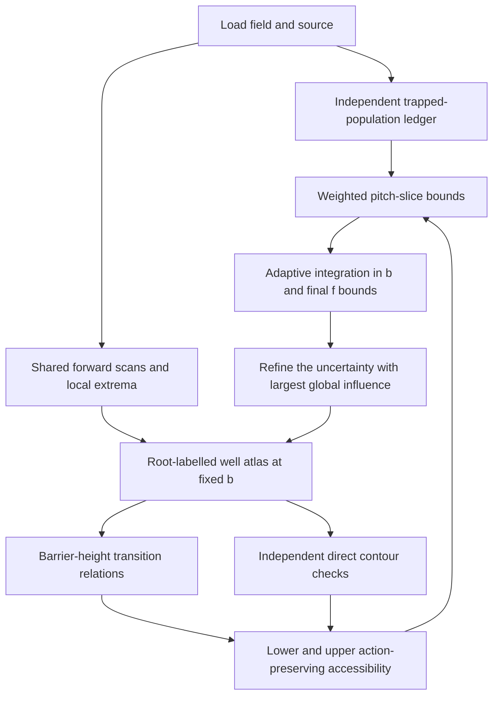

# Design: Computing the phase-space fraction connected to the plasma edge

**Repository:** `https://github.com/landreman/alpha_analysis`
**Active plan:** branch-labelled well atlas and bounded accessibility, adopted 2026-09-11
**Decision:** [ADR 0010](adr/0010-branch-atlas-and-bounded-f.md)
**Work queue:** §23 and [STATUS.md](STATUS.md); the next milestone is **R0**

This document is normative. It specifies the intended algorithm, not a claim that
all described modules already exist. Sections 3–5 retain the physical metric and
transition rules. R0–R8 replace the unfinished development sequence 10.3–18.
Historical milestones 0–10.2 remain completed under their original criteria;
10.3 is retired **without being marked complete**. Do not restart it to satisfy
an obsolete cut-coverage target.

The [old design](history/DESIGN-pre-redesign.md),
[old implementation notes](history/STATUS-pre-redesign.md), and
[reviewed independent proposal](2026-09-03-algorithm-redesign.md) preserve the
reasoning and experiments. Historical instructions do not override this plan.
Existing mesh/cut APIs and their physics regressions remain supported. Neither
this redesign nor a report of explicit failure is evidence that the old 95%
cut criterion passed.

## 1. Purpose and scope

Compute the existential accessibility fraction \(f\) of §3 for realistic Boozer
magnetic fields, with a useful lower and upper enclosure. At fixed bounce field
\(b\), permitted paths follow connected constant-\(J\) contours and all allowed
trapping-class transitions. This is an upper envelope of possible collisionless
loss, not a probabilistic capture model or a finite-time guiding-centre loss rate.

The production path is:

1. independently account for the total trapped birth population;
2. reuse forward field-line scans and extrema across pitch values;
3. represent wells by continued entry/exit roots in overlapping local charts;
4. locate actual barrier crossings from local extremum-height fields;
5. propagate definite and possible accessibility while preserving action;
6. integrate weights and all unresolved contributions; refine uncertainty in \(f\).

### 1.1 Deliverable and initial acceptance contract

The primary result is \([f_L,f_U]\), with the full width \(f_U-f_L\le0.01\)
for each of the five reference equilibria. This is an **absolute full width**;
a midpoint has uncertainty at most 0.005 if the enclosure is valid. It is not
±0.01 and not a relative error. A wider interval is a useful diagnostic but does
not meet accuracy acceptance. Distinguish model-only bounds, field-level bounds,
and statistical confidence intervals (§13.4).

The reference source is \(h(\rho)=1\), the existing API default. Every report must
record the actual source; also test a nonconstant source. This choice does not
retroactively establish the source used by unarchived exploratory experiments.
Accuracy for another source requires reweighting/reintegration and new evidence.

R8 requires at least **29 of 30 physical file/pitch cases** to achieve the slice
criterion (§20.3), and all five full-equilibrium results to meet the interval-width
criterion. These are separate requirements; four backend repetitions do not make
four independent physical successes. Performance controls are in §22.4.

### 1.2 Non-goals and deferred optimizations

Do not add collisions, slowing down, electric fields, finite-orbit-width dynamics,
probabilistic capture, or passing-to-trapped bridges to this metric. Do not require
complete classification of every degenerate event when a valid global enclosure
already meets accuracy. Exact handling of an influential unresolved event may
still be necessary if its uncertainty will not shrink.

Reeb graphs (one point per connected action contour), orbit-window sampling,
spline scan surrogates, fast circle-rotation first-hit searches, Numba, and symmetry
reduction are optional later optimizations. None is a prerequisite to R0–R8.
Ordinary connectivity of a Reeb graph is **not** the accessibility rule (§11.5).
No new base dependency or numerical-core boundary crossing is approved by this plan.

## 2. Existing repository and integration baseline

Retain the public interfaces in `boozer_field.py`, `bounce_points.py`, and
`J_invariant.py`. The legacy selected-well action is a regression comparison,
not a production method for counting all wells. Existing `j_connectivity` field,
normalization, root/quadrature, synthetic, mesh/cut, and visualization routines
are assets to reuse or compare, not permission to infer their convergence on all
real fields. New functionality belongs under `alpha_analysis/j_connectivity/`.

Use Python 3.10+ and the clean `.venv` based on conda `20220806-03` as specified
in [AGENTS.md](../AGENTS.md). Preserve the numerical/test budgets and dependency
boundaries. Do not use the Python 3.13 environment named there.

### 2.1 PR #24 and the baseline migration

At review on 2026-09-11, [PR #24](https://github.com/landreman/alpha_analysis/pull/24)
is an open draft at `c11fb305da89d75c552ecf61b03d34895c5834e6`; its Python Tests
jobs fail. Its failed 120-case experiment is valuable evidence. **Do not merge
it as-is or declare milestone 10.3 complete.** This planning edit does not modify
its code, tests, CI, or GitHub state.

Preferred integration: land this planning/evidence change in a **Markdown/data-only
PR based on current main**, then close #24 as superseded while retaining its branch
and recorded evidence. Check current main and remote state when executing this
handoff. Do not accidentally include #24's implementation diff in the planning PR.
Carry the historical 10.3 report/JSON and ADRs with the planning PR if they are not
already on main; preserve the raw report and JSON, including the recorded crash.

R0 starts from the plan-bearing main baseline. Selectively port a #24 fix only
when a retained API or a new acceptance criterion needs it, together with its
regression test and an explicit explanation. Importing its coordinator and event
machinery wholesale is not required. Run the baseline gate, and investigate any
failure other than the explicitly superseded policy described next.

If a chosen baseline includes
`test_matrix_report_meets_milestone_10_3_acceptance`, R0 replaces its obsolete
success assertion with a **historical evidence regression** under ADR 0010:
verify 120 cases, the fixed 32/10/77/1 classification census, 42/120 success under
the old definition, the disclosed exception, and provenance/terminal information
where the saved schema supplies it. Do not rewrite the JSON, pretend the crash
was absent, lower the 95% constant, or use `skip`/`xfail`. Scientific tests of
signs, well identity, cuts, quadrature, and failure accounting remain in force.
If the old test is absent on main, add the historical evidence check without
importing the obsolete coordinator just to exercise it. This narrow policy
migration is already approved; it does not authorize weakening unrelated checks.

## 3. Physical definition of the metric

### 3.1 Source and phase-space fraction

Let \(W=v^2/2\) be the specific kinetic energy and let \(W_0\) be the alpha birth specific energy. The isotropic monoenergetic source is

\[
S(\mathbf x,\mathbf v)
= \delta(W-W_0)\,h(\rho),
\]

where \(\rho\in[0,1]\) labels flux surfaces and \(h(\rho)\ge 0\) is a source profile known only up to an overall normalization.

Define

\[
f=\frac{N}{D},
\]

with

\[
N=\int d^3x\int d^3v\,S\,\Theta,
\qquad
D=\int d^3x\int d^3v\,S.
\]

The denominator is

\[
D
=4\pi\sqrt{2W_0}
\int_0^1 d\rho\,h(\rho)\frac{dV}{d\rho}.
\]

Let

\[
v_0=\sqrt{2W_0}.
\]

### 3.2 Coordinates

Use straight-field-line Boozer coordinates \((s,\theta,\zeta)\), where

\[
s=\rho^2=\frac{\psi}{\psi_{\mathrm{edge}}},
\qquad
\alpha=\theta-\iota(s)\zeta,
\]

and \(2\pi\psi\) is the toroidal flux. The magnetic field can be written locally as

\[
\mathbf B=\nabla\psi\times\nabla\alpha.
\]

The toroidal coordinate is periodic over one field period,

\[
0\le \zeta < L_\zeta,
\qquad
L_\zeta=\frac{2\pi}{N_{\mathrm{fp}}},
\]

and \(0\le\theta<2\pi\).

The implementation should work on the one-field-period quotient. Numerator and denominator then both acquire the same factor \(1/N_{\mathrm{fp}}\), which cancels in \(f\).

### 3.3 Magnetic moment and bounce field

The magnetic moment is

\[
\mu=\frac{v_\perp^2}{2B}.
\]

At a bounce point, \(v_\parallel=0\), so

\[
W_0=\mu B_b,
\qquad
B_b=\frac{W_0}{\mu}.
\]

The implementation must use \(B_b\), or equivalently \(\mu\), as the conserved pitch variable. It must not follow contours at fixed radius-dependent normalized pitch such as

\[
\lambda_n=\frac{B_b-B_{\min}(\rho)}{B_{\max}(\rho)-B_{\min}(\rho)},
\]

because constant \(\lambda_n\) is generally not constant \(\mu\) when the local extrema vary radially.

Passing particles have \(\Theta=0\). For \(B_b\) greater than the global maximum of \(B\), no bounce occurs and the state is passing.

### 3.4 Definition of \(\Theta\)

At fixed \(B_b\), each ordinary trapped well is a maximal field-line interval on which

\[
B<B_b.
\]

A trapped state is represented by its **incoming bounce point**, defined using the orientation along \(+\mathbf B\):

\[
B(\mathbf x_-)=B_b,
\qquad
\mathbf b\cdot\nabla B(\mathbf x_-)<0.
\]

Starting from \(\mathbf x_-\), follow \(+\mathbf B\) until the next outgoing crossing \(\mathbf x_+\):

\[
B(\mathbf x_+)=B_b,
\qquad
\mathbf b\cdot\nabla B(\mathbf x_+)>0.
\]

The state is edge connected if there exists a finite sequence of the following operations that reaches \(\rho=1\):

1. move within a connected component of a constant-\(J\) contour on one continuous trapping sheet;
2. at a trapping-class transition, jump to every well branch permitted by the split/merge relation, adopting the corresponding new value of \(J\), and continue on a constant-\(J\) contour on that branch.

Then

\[
\Theta=
\begin{cases}
1, & \text{if such a path reaches }\rho=1,\\
0, & \text{otherwise.}
\end{cases}
\]

The transition relation is undirected for this metric. Passing motion is not a bridge between trapped states: if a trapped branch terminates by becoming passing, that path terminates.

States exactly on critical curves have zero phase-space measure. For visualization, assign them the closure convention

\[
\Theta=1
\quad\text{if any incident regular branch is edge connected}.
\]

---

## 4. The space of wells at fixed \(B_b\)

### 4.1 Incoming-bounce surface

For fixed \(b=B_b\), define

\[
\Sigma_b^-=
\left\{
(s,\theta,\zeta):
B(s,\theta,\zeta)=b,
\quad
\mathbf b\cdot\nabla B<0
\right\}.
\]

Every regular point of \(\Sigma_b^-\) corresponds to exactly one trapped well. Therefore:

- a long well extending across many field periods is one point on \(\Sigma_b^-\);
- several wells on one field line correspond to several distinct points on \(\Sigma_b^-\);
- no global integer “well number” is needed;
- the complicated periodicity of \(\alpha\) is avoided;
- changes from QI-like to QA- or QH-like winding appear as ordinary topology and homology of curves on \(\Sigma_b^-\).

The incoming-bounce surface remains the physical state space. The active algorithm represents it by overlapping, root-labelled local charts (§8), sharing field-line scans across fixed-\(b\) slices. A background tetrahedral mesh and a globally cut surface are optional legacy diagnostics, not prerequisites.

### 4.2 Action and bounce-time quantities

For a well from entry \(\ell_-\) to exit \(\ell_+\), define the half-bounce action length

\[
A
=
\int_{\ell_-}^{\ell_+}
\sqrt{1-\frac{B}{b}}\,d\ell,
\]

and the half-bounce time length

\[
K
=
\int_{\ell_-}^{\ell_+}
\frac{d\ell}{\sqrt{1-B/b}}.
\]

Then the physical full-bounce longitudinal invariant and full bounce time are

\[
J=2v_0 A,
\qquad
\tau_b=\frac{2K}{v_0}.
\]

At fixed \(W_0\), contours of \(J\), \(A\), or any global constant multiple of them are identical. The new code should store `action_length = A` as its authoritative action. For compatibility with the current plotting code, it may also expose

\[
J_{\mathrm{normalized}}=\frac{A}{L_{\mathrm{ref}}},
\qquad
L_{\mathrm{ref}}=R_{00}\frac{2\pi}{N_{\mathrm{fp}}},
\]

which matches the normalization used by the existing `compute_J_invariant()` implementation.

In Boozer coordinates, let

\[
C(s)=G(s)+\iota(s)I(s).
\]

Along a field line,

\[
\frac{d\theta}{d\zeta}=\iota(s),
\qquad
\frac{d\ell}{|d\zeta|}=\frac{|C(s)|}{B}.
\]

Hence

\[
A
=
\int_{\zeta_-}^{\zeta_+}
\frac{|C|}{B}
\sqrt{1-\frac{B}{b}}\,|d\zeta|,
\]

\[
K
=
\int_{\zeta_-}^{\zeta_+}
\frac{|C|}{B\sqrt{1-B/b}}\,|d\zeta|.
\]

The \(A\) integrand vanishes at an ordinary bounce point. The \(K\) integrand has an integrable inverse-square-root endpoint singularity. At a marginal maximum, \(K\) diverges logarithmically; this requires special quadrature treatment near \(\Gamma_{\max}\).

### 4.3 Surface measure and computational expression for \(f\)

The natural measure on the incoming-bounce surface is

\[
|d\psi\wedge d\alpha|.
\]

Using \(s=\psi/\psi_{\mathrm{edge}}\), the common factor \(\psi_{\mathrm{edge}}\) cancels between numerator and denominator. Define

\[
\omega=ds\wedge d\alpha.
\]

The numerator becomes

\[
N
=
2\pi\int d\mu
\int_{\Sigma_\mu^-}
h(\rho)\,\tau_b\,\Theta\,
|d\psi\wedge d\alpha|.
\]

Since

\[
|d\mu|=\frac{W_0}{b^2}\,db,
\]

and \(\tau_b=2K/v_0\), the dimensionless fraction can be evaluated without explicitly retaining \(W_0\) or \(\psi_{\mathrm{edge}}\):

\[
\boxed{
 f
 =
 \frac{
 \displaystyle
 \int_{B_{\min}^{\mathrm{global}}}^{B_{\max}^{\mathrm{global}}}
 \frac{db}{b^2}
 \int_{\Sigma_b^-}
 h(\sqrt{s})\,K\,\Theta\,|\omega|
 }{
 \displaystyle
 2\int_0^1 ds\,h(\sqrt{s})
 \int_0^{2\pi}d\theta
 \int_0^{2\pi/N_{\mathrm{fp}}}d\zeta\,
 \frac{|G+\iota I|}{B^2}
 }.
}
\]

Define the source-weighted normalized volume factor

\[
V_h
=
\int_0^1 ds\,h(\sqrt{s})
\int_0^{2\pi}d\theta
\int_0^{2\pi/N_{\mathrm{fp}}}d\zeta\,
\frac{|G+\iota I|}{B^2}.
\]

For a pitch slice, define

\[
Q(b)
=
\int_{\Sigma_b^-}
h(\sqrt{s})\,K\,\Theta\,|\omega|.
\]

Then

\[
f=\frac{1}{2V_h}\int \frac{Q(b)}{b^2}\,db.
\]

This is the primary computational formula.

### 4.4 Axis-regular representation of the surface measure

Use logical Cartesian coordinates in the poloidal disk:

\[
x=\rho\cos\theta,
\qquad
y=\rho\sin\theta,
\qquad s=x^2+y^2.
\]

The volume domain is the periodic solid cylinder

\[
x^2+y^2\le 1,
\qquad
0\le\zeta<L_\zeta,
\]

with the two end disks identified.

Although \(d\theta\) is singular at the axis, the two-form \(\omega\) is regular. Since

\[
d\alpha=d\theta-\iota(s)d\zeta-\iota'(s)\zeta\,ds,
\]

we have

\[
\omega
=ds\wedge d\theta-\iota(s)ds\wedge d\zeta.
\]

In \((x,y,\zeta)\),

\[
\boxed{
\omega
=2\,dx\wedge dy
-2\iota(s)
\left(x\,dx\wedge d\zeta+y\,dy\wedge d\zeta\right).
}
\]

For tangent vectors \(u\) and \(v\), evaluate

\[
\begin{aligned}
\omega(u,v)
={}&2(u_xv_y-u_yv_x)\\
&-\iota(s)
\left[
(2xu_x+2yu_y)v_\zeta
-(2xv_x+2yv_y)u_\zeta
\right].
\end{aligned}
\]

This formula should be used for triangle quadrature. It avoids constructing a globally single-valued \(\alpha\) and remains regular at \(x=y=0\).

---

## 5. Critical curves and trapping-class transitions

### 5.1 Parallel derivatives

Define the derivative along a field line at fixed \(s\):

\[
D_\parallel^{(\zeta)}
=\iota(s)\partial_\theta+\partial_\zeta.
\]

Then

\[
\mathbf b\cdot\nabla B
=\frac{B}{G+\iota I}
D_\parallel^{(\zeta)}B.
\]

The code must use the physical sign, including the sign of \(G+\iota I\). It must not assume that increasing \(\zeta\) is always the \(+\mathbf B\) direction.

At a marginal point on \(B=b\),

\[
D_\parallel^{(\zeta)}B=0.
\]

The sign of the second derivative

\[
D_\parallel^{(\zeta)2}B
\]

distinguishes a local minimum from a local maximum.

### 5.2 Boundary curves of \(\Sigma_b^-\)

The boundary can contain:

- `EDGE`: \(s=1\);
- `GAMMA_MIN`:
  \[
  B=b,
  \quad \mathbf b\cdot\nabla B=0,
  \quad D_\parallel^{(\zeta)2}B>0;
  \]
- `GAMMA_MAX`:
  \[
  B=b,
  \quad \mathbf b\cdot\nabla B=0,
  \quad D_\parallel^{(\zeta)2}B<0;
  \]
- `AXIS`: an intersection with \(s=0\), if present;
- `DEGENERATE`: points for which the second derivative is too small to classify reliably.

At `GAMMA_MIN`, a well is born or dies with \(A\to0\). Positive-action contours do not continue through it, so no transition hyperedge is added.

At `GAMMA_MAX`, a well split/merge occurs.

### 5.3 Generic split/merge relation

Let \(m\in\Gamma_{\max}\), with preceding ordinary incoming crossing \(a\) and next ordinary outgoing crossing \(d\), ignoring the tangent contact. These define limiting well endpoints. The active implementation obtains them from continued root pairs and forward field-line data; it need not launch a backward scan from \(m\).

At the transition, three limiting wells meet:

- merged parent \(W=[a,d]\);
- first child \(w_1=[a,m]\);
- second child \(w_3=[m,d]\).

Their action lengths satisfy

\[
A_W=A_{w_1}+A_{w_3}.
\]

The curve of points \(a\) is the companion transition curve \(T\). Across \(T\), the first-return exit jumps, so \(A\) is multivalued in the geometric projection. Separate branch records carry the parent and child values. No interpolation may cross that jump; constructing a global mesh cut is not required.

The transition correspondence is pointwise in a common curve parameter \(u\):

\[
T_W(u)
\longleftrightarrow
T_{w_1}(u)
\longleftrightarrow
\Gamma_{w_3}(u).
\]

For the present existential definition, all three are mutually connected.

### 5.4 Multiway and degenerate transitions

The data model must support an arbitrary number of ports, even if the first implementation only resolves generic three-port events. A transition is represented as a hyperedge node with \(m\ge 3\) incident port curves.

If the code detects any of the following, it must refine or report an unresolved nongeneric event:

- \(|D_\parallel^{(\zeta)2}B|\) below tolerance;
- two or more marginal maxima at the same event parameter;
- a return-root change larger than a generic split/merge, or an unexplained extrema-count change that might conceal a barrier reaching \(b\);
- several \(\Gamma_{\max}\) components mapping to the same part of \(T\);
- failure of \(A_W\approx A_{w_1}+A_{w_3}\) under refinement.

Do not arbitrarily decompose a nongeneric event into binary transitions. An extrema pair born or lost strictly below \(b\), with ordinary endpoints and a certified interior gap, is not a trapping transition. Preserve its diagnostic data without changing well connectivity. Uncertain events may be enclosed instead of completely classified, but their possible connectivity propagates globally (§11); small local measure alone never justifies dropping them.

---

## 6. High-level numerical algorithm

A valid partial atlas is useful only if its uncovered states and possible links
are enclosed. A `REGULAR` geometry status or a small local residual is not a
reachability certificate. Stop at the work budget and return the remaining gap;
do not turn budget exhaustion into a successful accuracy result.

## 7. Magnetic-field evaluation

### 7.1 Fourier representation and derivatives

Support cosine and sine coefficients, including asymmetric fields:

\[
B=\sum_k[B_k^c(s)\cos(m_k\theta-n_k\zeta)
+B_k^s(s)\sin(m_k\theta-n_k\zeta)].
\]

With \(k=m\iota-n\), evaluate analytic Fourier derivatives:

\[
D_\parallel B=\sum[-kB^c\sin\chi+kB^s\cos\chi],\qquad
D_\parallel^2B=-\sum k^2[B^c\cos\chi+B^s\sin\chi].
\]

Cache radial coefficients and jointly evaluate field/derivatives at fixed radius.
Retain all modes unless a separate accepted decision supplies a controlled
approximation; amplitude alone does not bound topology error.

### 7.2 Field interface and surrogates

Retain `BoozerFieldLike`: `nfp`, `B`, `dB_ds`, `dB_dtheta`, `dB_dzeta`, `D_B`,
`D2_B`, `iota`, `G`, `I`, with pointwise NumPy broadcasting. Obtain `iota'` and
other radial derivatives from consistent interpolation where needed. The physical
sign of tracing uses `sign(G+iota*I)`.

Initially use the original field to accept roots, extrema, and topology decisions.
A spline can propose scan brackets later, but must carry value/derivative error
bounds and a check for missed roots before it certifies anything. Agreement at
sampled points and a tiny value error alone do not establish topology preservation.

### 7.3 Axis and radial interpolation

Retain the tested axis continuation: poloidal harmonic \(m\) scales as
\(\rho^{|m|}\). A chart using \(\alpha\) is singular at \(s=0\); use a regular
local disk chart, or enclose an omitted core. If a core is omitted, include both
its own birth weight and every possible accessibility connection through it.
A small core volume alone does not bound its global connectivity influence.

## 8. Branch-labelled well atlas

### 8.1 Local state representation

In a lifted local chart with \(q=(s,\alpha)\), define

\[
F(q,z;b)=B(s,\alpha+\iota(s)z,z)-b.
\]

A branch owns an incoming root and its **first** outgoing root in the physical
field direction, with \(F<0\) between ordinary endpoints. Store the root lifts,
physical orientation, chart ID, branch ID, coverage interval, endpoint status,
and error data. Do not impose `z_out > z_in` for negative `G+iota*I`.

The incoming-bounce projection is a local diffeomorphism for \(s>0,g<0\), not
necessarily a global graph. Several roots and even several points of one connected
sheet may share \((s,\alpha)\). Each branch has its own action values and integration
ownership. Continue actual endpoint roots; neither Euclidean proximity, integer
well count, nor a quantized extrema hash determines identity.

### 8.2 Coverage, periodicity, and overlap

Use a uniform or adaptively controlled transverse mesh first. Overlapping charts
must identify equivalent states explicitly while assigning each physical incoming
bounce exactly one integration owner. Retain physical coordinates for cross-checks.
The seam identification is

\[
(\alpha,z=L_\zeta)\sim(\alpha+\iota(s)L_\zeta,z=0).
\]

This is radius dependent, and any additional integer winding remains authoritative.
Match neighboring radii as well as neighboring angular samples. An artificial scan
window boundary is not a well birth, death, transition, or passing boundary.

Continuation from a few seeds does not prove complete coverage. Account for
unseen disconnected wells, closed barrier loops inside cells, multiple crossings
on one cell edge, censored scan windows, and uncertain well multiplicity. Uncovered
regions remain possible states/links in the upper calculation. The independent
ledger checks weight conservation but cannot locate a missing connection for you.

### 8.3 Measure and local mesh

On each owned regular branch, the measure is exactly \(|ds\,d\alpha|\).
With \(x_\alpha=\sqrt{s}\cos\alpha,y_\alpha=\sqrt{s}\sin\alpha\), it is
\(2|dx_\alpha\,dy_\alpha|\). A cell's area times its well count is valid only
when that multiplicity and ownership are established throughout the cell.

Triangulate local branch cells when useful for piecewise-linear (PL) actions and
quadrature. PL means linear inside each triangle. Never interpolate across a
return discontinuity. Local boundary-bank IDs are distinct from global connected
sheet IDs: two banks of a slit may belong to the same connected sheet. A global
cut of an extracted 3-D surface is not required.

### 8.4 Refinement and certificates

Refine on root-conditioning/coverage failure, action interpolation error, barrier
uncertainty, ambiguous chart matching, quadrature error, or global accessibility
influence. Local bounds must include field evaluation/interpolation error.
For a local extremum height \(H(q)\), a Taylor exclusion test using
\(|H(q_0)-b|>\|\nabla H(q_0)\|r+Mr^2/2\) requires a validated Hessian bound
\(M\) on the entire cell and proof that the same branch exists there.
A few midpoint probes do not supply that bound or certify a unique crossing.

Near an extremum fold, the Hessian can grow without bound as curvature vanishes.
Use a separate enclosure/local solve or leave uncertainty; never present the
Taylor test as a universal certificate. Unknown cells do not have known exact
multiplicity or exact local weight merely because their geometric area is known.

## 9. Shared forward scans and bounce integrals

### 9.1 Catalogue and cache

Scan \(B\) along each lifted field line independently of \(b\). Store ordered
extrema, bracket information, scan coverage and root-completeness limitations.
For different pitches, query the same catalogue for maximal \(B<b\) intervals.
A per-line merge hierarchy (which allowed intervals join as \(b\) crosses a peak)
is a query accelerator, not a globally stable well label.

Share work among neighboring queries and resume scans rather than restarting at
a larger cap. Cache keys include field identity, radius, orientation, lift/window,
resolution/error controls, and coverage. An end of available data is censored,
not a physical outgoing bounce. Global extrema-count completeness is unnecessary
where a certified bound already excludes any hidden barrier at the relevant \(b\).

### 9.2 Root completeness and failure

Bracket and refine the first ordinary crossing with analytic derivatives and
safeguarded root solvers. Validate the physical incoming/outgoing signs and the
allowed interior. A Fourier-aware scan is a starting resolution, not proof that
an unobserved shallow extremum pair cannot exist. Use validated derivative/value
bounds or explicitly retain the potentially missed barrier region.

`MAX_PERIODS`, `ROOT_FAILURE`, `QUADRATURE_FAILURE`, tangent limits and uncertain
coverage remain distinct. A cap does not prove passing or zero accessibility.
The old incoming-root polishing controls remain valid for legacy callers.

### 9.3 Batched action and time quadrature

Compute \(A,K\) from §4.2 with the physical \(|C|/B\) line element. For ordinary
endpoints use an endpoint-regularizing transform, for example

\[
z(t)=\frac{z_-+z_+}{2}+\frac{z_+-z_-}{2}\sin t,
\quad -\pi/2\le t\le\pi/2,
\]

and integrate with the absolute transformed line element. Batch composite
Gauss–Legendre evaluations, using relevant extrema as breakpoints. Preserve stable
endpoint differences and a summed global integration error budget. Comparing
orders \(n\) and \(2n\) is an error estimate, not automatically a rigorous bound;
retain an independent adaptive reference and fallback or unresolved status.

Fix near-tangent cancellation/termination defects by diagnosis and independent
reference values, never by loosening the production tolerance to make a failure
disappear. At an exact separatrix, limiting \(A\) can be finite while \(K\)
diverges. Do not fabricate finite critical-vertex time values.

### 9.4 Optional orbit-window reuse and long-return solvers

After the ordinary chart baseline is correct, consecutive windows of one long
scan may provide multiple field-line labels. This can replace repeated lookahead
by shared coverage. Near rational rotational transform, one orbit may cluster or
fail to cover the angular domain: use multiple orbits or a controlled fallback.
Finite last-to-first closure and radial shear must be verified, not assumed.

A circle-rotation first-hit solver remains a later option if measured costs still
warrant it. It must certify crossing intervals, first-hit order, rational cases,
and accumulated integrals. None of the exploratory appendix timings or rare-tail
fractions is an accepted production bound or speed guarantee.

### 9.5 Identity versus diagnostic itinerary

Store extrema and winding for diagnostics and quadrature. Define physical branch
continuity by continued entry/first-exit roots and absence of a new \(B=b\) barrier.
An interior min/max pair can appear below \(b\) without changing this branch.
Replace any obsolete extrema-count veto with a barrier/root certificate; do not
merely disable the warning. Do not demand a complete global catalogue of irrelevant
below-\(b\) folds before computing a useful enclosure.

## 10. Barrier-height transitions

### 10.1 Local height fields

For a nondegenerate along-line extremum at \(z_j(q)\), define
\(H_j(q)=B(s,\alpha+\iota(s)z_j,z_j)\). It is independent of pitch and smooth
locally while \(D_\parallel^2B\ne0\). Its gradients are

\[
\partial_\alpha H_j=\partial_\theta B|_j,\qquad
\partial_s H_j=\partial_s B|_j+\iota'(s)z_j\partial_\theta B|_j.
\]

Track extrema branches locally with safeguarded continuation. Their heights and
local domains can be reused across pitches. The level curves \(H_j=b\) locate
candidate marginal barriers; determine which entry/exit branches own each barrier
before creating a transition. Not every extremum on a line belongs to every well.

### 10.2 Generic ports and common parameter

For a certified generic split, store the three limiting branches of §5.3 with
separate actions, orientation/lift data, and a common physical event parameter
\(u\). A transition port is the boundary curve on one incident branch.
Transfer at the **same event position**, adopting the destination action;
never match ports just by overlapping action ranges or nearest coordinates.
The child-3 incoming point can lie several windows away. Preserve the exact
radius-dependent seam map and integer lift in its correspondence.

Check action additivity by independent parent/child integrals and one-sided limits.
Minima create/destroy zero-action wells without positive-action transfer. A branch
becoming passing terminates that route; it is not a bridge to another trapped state.

### 10.3 Events and partial geometry

Equal-height contacts, degenerate endpoints, coincident symmetry curves, and
uncertified crossings may remain enclosed with all possible incident branches.
Resolve locally only when their global influence prevents the error target.
The new path does not require choosing among the old event-kind certifications
before any neighboring regular state can contribute.

Nevertheless, small or zero event measure does not prove small accessibility
influence, and shrinking local cells does not by itself prove gap convergence.
Track possible links through event cells in §11. A logarithmic separatrix model
requires nonzero curvature and a remainder bound; it is not a universal bound
at a degenerate endpoint where that curvature vanishes.

### 10.4 Transition interpolation

Subdivide port curves into monotone/constant action segments with bounded
interpolation error. Store common-parameter domains and full preimages for
constant maps. Preserve arbitrary port counts and self-transitions (ports on the
same connected sheet). A numerical root solution is accepted to its error budget,
not described as an exact continuous-field transition.

### 10.5 Legacy geometry

Keep existing background/extraction/cutting APIs and their independent invariants.
Use resolved reference cuts as comparisons and 3-D diagnostics. When changing that
legacy path, still test both mesh backends and both extractors, bounded mapping
budgets, periodic provenance, and no interpolation across duplicated banks.
Historical notes and ADRs describe that path; they are not prerequisites for the
atlas pipeline. A coarse sheet-incidence graph never determines accessibility.

## 11. Action-preserving accessibility

### 11.1 Direct contour oracle

Implement a field-based, branch-aware predictor-corrector contour follower, rather
than requiring the production atlas triangulation. It follows \(A=\text{constant}\)
with continued bounce roots, explicit seams, event branching, closure and saddle
handling. Any action gradient includes radial changes in \(C\), the magnetic field,
and \(\iota\); do not drop terms because endpoint contributions vanish.

An unsuccessful finite trace is unresolved, not unreachable. Verify all branches
closed/terminated before certifying a negative answer. Memoization cannot merge
disconnected contours with equal action. Return witness paths for positive answers
and reasons for completed negative or unresolved answers.

This oracle shares field/quadrature components but uses independent contour geometry.
Compare certified classifications away from uncertainty boundaries; continuous-field
and PL results need not agree exactly near a finite-resolution boundary.

### 11.2 Finite action and event-parameter bins

The initial production algorithm uses finite bins (the old design's action atoms)
per branch/cell and bins in \(u\) per monotone transition segment. Keep explicit
spatial adjacency. On a triangle with linear \(A\), a regular local level contour
is a single segment. Ordinary propagation preserves the action exactly before
conservative discretization. Equal numerical action in disconnected cells creates
no link.

For each exact local transfer, the lower calculation takes bins wholly contained
in its proven image; the upper takes every bin intersecting its possible image.
Include all interpolation/geometry error bands appropriate to each result's scope.
Both worklists terminate because only finitely many bits can change. Constant
maps use their full preimage, not division by a zero slope.

### 11.3 Edge seeds, transitions and global uncertainty

Seed action values actually attained on the physical `EDGE`, with lower/upper
handling of uncertainty. Ordinary cell links preserve action. Transition links
map reachable action values back to the common \(u\), then forward through **all**
allowed ports at that \(u\), adopting each port's action.

The lower calculation uses only certified paths. The upper must cover every
physically possible connection through unknown geometry, omitted branches/cores,
capped wells and events. An unresolved region may be represented as a wildcard
joining its possible boundary states, but its incidence must itself conservatively
cover missing states. A wildcard touching the plasma edge must allow edge arrival.
One convenient but loose wildcard is acceptable as an upper enclosure, never as
an exact description or a lower connection.

Propagate unknown influence through the whole graph. A resolved cell can remain
uncertain if its only possible edge route uses an unresolved event elsewhere.
Refinement priority uses the resulting global weighted gap, not the local size
of the problematic cell. Contributions from multiple wildcards can overlap;
do not add overlapping influence masses or claim unique attribution without a
counterfactual calculation.

### 11.4 Cycles, termination and critical values

Transition cycles may generate indefinitely many distinct actions. There is no
general contraction theorem or geometric tail bound for them, especially with
undirected inverse maps. Finite bins remain the correctness path. Continuous
interval propagation may accelerate it only with a work cap and a checked result.

Refining action/parameter bins on a fixed certified geometry should grow the
inner set and shrink the outer set. For geometry changes, certify how previous
bounds are transported before asserting nesting. Handle constant-action cells,
equal vertex values, saddles, and constant port maps explicitly; symbolic
perturbation must not manufacture finite-weight links or erase flat regions.

### 11.5 Reeb graphs are optional compression

A Reeb point represents one connected constant-\(A\) contour. Moving along a Reeb
edge changes \(A\), so ordinary connected components of a Reeb graph are **not**
edge accessibility. On a no-transition annular sheet with \(A=s\) and `EDGE` at
\(s=1\), all interior contours are inaccessible although the Reeb graph is one
connected interval. Keep this as a regression for every reachability backend.

A future Reeb representation must carry reachable subsets of its edges and the
same pointwise transition maps/bounds as above. Neither two union-finds, a few
samples between initial critical values, nor a presumed geometric cycle remainder
replaces the finite action-preserving calculation.

## 12. Weighted integration and the population ledger

### 12.1 Independent total trapped population

Let \(\chi_{\rm tr}(s,\theta,\zeta;b)\) indicate that the allowed field-line
interval containing the point is genuinely bounded by bounces. Then

\[
Q_{\rm total}(b)=\int ds\,d\theta\,d\zeta\,
\frac{h(\sqrt{s})|C(s)|}{B\sqrt{1-B/b}}
\,[B<b]\,\chi_{\rm tr}.
\]

This is the total well weight before accessibility is imposed. If field lines
are dense on their flux surfaces for almost every radius, one may replace
\(\chi_{\rm tr}\) on \(B<b\) by \([B_{\max}(s)>b]\), with equality/tangent
limits handled separately. Do not use this shortcut on a rational-transform
plateau without analysis. For example, \(\iota=0,B=2+\cos\theta\) independent
of \(\zeta\) has no trapped wells, even though some points have
\(B<b<B_{\max}(s)=3\). A surface-maximum formula is then an upper count,
not an equality. Use linewise trapping, a justified dense-line assumption, or a
conservative enclosure and record which was used.

Under the dense-line assumption the total trapped fraction can also be computed
without singular pitch-slice quadrature:

\[
T=\frac1{V_h}\int ds\,d\theta\,d\zeta\,
\frac{h(\sqrt{s})|C|}{B^2}\sqrt{1-\frac{B}{B_{\max}(s)}}.
\]

Use validated bounds on the surface maxima and quadrature when claiming an
upper/lower enclosure. An optimization result or a coarse sampled maximum is not
a proven upper bound. R0 establishes exact synthetic controls and explicit error
scope before relying on real-field ledger bounds.

### 12.2 Accounting rules

Maintain disjoint ownership of definitely accessible, definitely inaccessible,
and unresolved birth weight. For a slice, let \(M_R^L\) and \(M_N^L\) be lower
weight bounds for definitely reachable and definitely nonreachable states, where
nonreachability comes from the **upper** connectivity calculation. Then

\[
Q_L=M_R^L,\qquad Q_U=Q_{\rm total}^{U}-M_N^L.
\]

A tighter independently bounded possible-reachable integral may reduce \(Q_U\).
A missing-weight upper bound is
\(Q_{\rm total}^{U}-M_{\rm covered}^{L}\), never simply subtraction of two
uncontrolled estimates. Include both integration errors and check disjoint
coverage. Aggregate missing mass does not specify exact masses or connections of
individual unknown cells. Contradictory or materially negative residuals are errors;
do not clamp them away. Preserve incoming/outgoing flux checks where applicable.

### 12.3 Regular and marginal cell quadrature

On a regular owned branch integrate \(hK|ds\,d\alpha|\) over reachable subregions.
For PL actions, clip triangles to action intervals and integrate each polygon;
area fraction times an arbitrary mean weight is insufficient. Evaluate or bound
\(K\) consistently at interior nodes.

At a nondegenerate marginal maximum, use interior quadrature and controlled
singularity subtraction or adaptive subdivision. \(K\)'s logarithmic asymptotic
is a useful accelerator only with curvature and remainder control; child and
parent coefficients differ. Use a separate enclosure near zero-curvature events.
Unknown \(A\) or \(K\) is retained in the ledger and connectivity bounds.

### 12.4 Whole pitch bands versus subsets of wells

Because \(b\) is conserved, an entirely omitted pitch band contributes at most
its independently bounded total trapped birth weight. This can be an economical
way to handle extreme pitches, but each required R8 slice is still tested and
scored against its own accuracy requirement.

A short scan cap, omitted core, or omitted long-well family **within** a pitch
slice can change accessibility of other states. Bound its global influence,
not only its direct weight. Never treat the exploratory ≤0.3% tail as permission
to discard it. Source-dependent tail fractions must be remeasured with uncertainty.

## 13. Normalization, outer integration and reported bounds

### 13.1 Denominator

Retain

\[
V_h=\int_0^1ds\,h(\sqrt{s})|C(s)|
\int_0^{2\pi}d\theta\int_0^{L_\zeta}d\zeta\,B^{-2}.
\]

Use independently converged radial/periodic quadrature and include denominator
uncertainty in ratio bounds. `source_profile` takes \(\rho\), not \(s\).

### 13.2 Pitch support

Use radially global magnetic bounds for the conserved pitch variable. Resolve
support boundaries in \(s\) when integrating the ledger; a quadrature grid cutting
across an unresolved support boundary is not a certified residual weight.
Safe global field brackets require validated extrema/error margins or explicit
supplied bounds. Per-surface maxima do not replace global pitch conservation.

### 13.3 Outer quadrature

Compute \(f=(2V_h)^{-1}\int Q(b)b^{-2}\,db\) with adaptive, cached interior
pitch evaluations, initially a nested midpoint rule. Peak-height information can
suggest refinement/breakpoints but does not enumerate every change in
constant-action accessibility. Do not replace adaptivity with a supposedly complete
list of magnetic critical values without a new proof and tests.

Integrate lower and upper slice functions with explicit outer error handling.
A midpoint-doubling difference is an estimate, not automatically an enclosure of
unsampled pitch structure. Return an estimated result with unverified error scope
if necessary, but do not count it as a field-level bounded success. Whole-band
ledger bounds can enclose unresolved outer intervals. Ratio lower bounds use the
upper denominator, and upper bounds use the positive lower denominator.

### 13.4 Result contract and error scope

`FractionResult` should provide `f_lower`, `f_upper`, optional midpoint `f`,
`status`, `bound_scope`, source/field identity, `V_h` with error information,
pitch nodes/results, wall times, convergence controls, and an error ledger.
Distinguish:

- **model enclosure:** proven for the stated discrete/interpolated model;
- **field enclosure:** also covers field approximation, missing geometry,
  integration, support, and outer errors;
- **estimate:** one or more of these errors remain convergence estimates;
- **statistical interval:** sampling confidence at a stated level, separate
  from numerical uncertainty and completion rate.

The field-level target is the declared finite Fourier field together with its
specified radial and axis interpolation, identified by data and implementation
hashes. Enclose additional numerical/surrogate errors relative to that field.
This does not prove errors relative to an unknown continuum equilibrium or
unprovided Fourier modes; sensitivity to supplied equilibrium resolution is
reported separately.

Only a field enclosure meeting the width/time criteria is an R8 bounded success.
A small model-only gap is not enough. A reported upper/lower interval must satisfy
\(0\le f_L\le f_U\le1\) with a consistent positive denominator. A valid
conservative raw enclosure may be intersected with the known probability range
[0,1] or an independently proved trapped-fraction bound; retain the raw endpoints
and justification. Reject an empty intersection or inconsistent weight accounting.
Do not clamp an invalid numerical point estimate to hide a failure. A midpoint is
optional and is not a measured loss probability.

### 13.5 Birth-space validation and optional gap estimates

Independently sample birth positions with density proportional to
\(h(\sqrt{s})|C|/B^2\) and \(\xi=v_\parallel/v_0\) uniformly in [-1,1]; set
\(b=B/(1-\xi^2)\). With correctly classified \(\Theta\), \(f=E[\Theta]\).
Closed/rational lines need the same trapping qualification as §12.1.

Use direct contours for sampled accessibility, retaining failed queries as
interval-valued unknown outcomes. Report sample count, seeds, confidence method,
source, unresolved fraction, and numerical bias controls. Shared field code does
not make all failure modes independent of the atlas.

An optional estimator may sample the **whole globally ambiguous population**,
not only event cells. Its normalized well-space measure is
\(hK\,ds\,d\alpha\,db/(2V_hb^2)\). The variance bound \(G^2/(4n)\) for gap
mass \(G\) requires correct independent sampling, known mass, and valid binary
classifications. An upper missing-mass budget alone does not supply this sampler.
Sampling does not shrink the deterministic enclosure; report the estimate separately.

## 14. Package layout and implementation status

Use plain arrays/integer IDs in the core. Module names below are proposed, not
existing import guarantees; settle small API choices in the implementing PR.

| Area | Reuse or proposed module | Role |
| --- | --- | --- |
| Field/normalization | `field.py`, `denominator.py` | Existing kernels and denominator |
| Population ledger | `population.py` | Independent trapped weight and enclosures |
| Forward scans | `well_trace.py`, `well_catalogue.py` | Existing reference plus shared scans |
| Local branches | `well_atlas.py` | Coverage, ownership, root and seam identities |
| Barrier maps | `barrier_fields.py` | Local height fields and transition ports |
| Direct oracle | `contour_trace.py` | Continuous-field contour queries |
| Accessibility | `intervals.py`, `reachability.py` | Finite bins and global uncertainty |
| Integration | `atlas_quadrature.py`, `pitch_quadrature.py` | Slice and outer integration |
| Results | `pipeline.py`, `io.py`, `diagnostics.py` | Provenance, restart and reports |
| Views | `visualization.py` | Chart, path, population and optional 3-D views |

Existing `background_mesh`, `surface_extract`, `surface_data`, `surface_refine`,
`critical_curves`, `transitions`, `transition_events`, `mesh_cut`, and any adopted
`refinement` code remain legacy/reference modules. Do not remove public functions
or add mandatory geometry dependencies merely to match this table.

## 15. Public API

### 15.1 Main calculation

Proposed endpoint: `compute_j_connected_fraction(field, source_profile=None,
config=None) -> FractionResult`, with a uniform source by default. Keep existing
public APIs backward compatible. This endpoint is not claimed to exist before R7.

### 15.2 Pitch slice

The new pitch-slice API consumes a reusable catalogue/atlas context, `b`, source,
and controls; it does not require a `BackgroundMesh`. Return bounded weights,
coverage/transition uncertainty, classification scope, provenance and timings.
Legacy callers continue to use their existing interfaces.

### 15.3 Diagnostics

Expose plots of well-count/branch maps, barrier heights, matched seam states,
constant-action contours, witness paths, globally uncertain populations, ledger
closure, and error-versus-runtime. Preserve optional 3-D inspection of reference
surfaces. Do not label unknown states as inaccessible in a visualization.

### 15.4 Reuse

A context can reuse field-only scans over multiple pitches and source profiles.
Weighted integrals depend on the source; cached results must not silently reuse
weights from a different source. All reused geometry must match its field/controls.

## 16. Configuration and defaults

Use validated dataclasses for field/scan, atlas, transitions, action bins,
quadrature, runtime, and output controls. Preserve existing config compatibility.
Authoritative controls include:

- field identifier, retained modes, radial scheme, source identity;
- scan resolution/completeness, root tolerances, period/window cap;
- chart coverage/refinement, branch matching and error predicates;
- action/time integration errors and interpolation controls;
- action and common-parameter bin resolutions and work caps;
- independent population/support/denominator/outer error controls;
- full `f` width target 0.01, slice relative width target 0.01;
- whole-equilibrium and slice hard guards, worker count, cold-start accounting;
- optional statistical confidence, sample counts and seeds.

Defaults are starting work controls, not proof of accuracy. One declared adaptive
policy applies to all benchmark fields; no per-case tuning to obtain success.
Changing a scientific tolerance or acceptance budget requires a recorded decision.

## 17. Visualization and diagnostics

### 17.1 Required interpretation

Every new geometric object gets a diagnostic plot and a named numerical invariant.
Label physical versus chart coordinates, units, field/source, pitch, controls,
error scope, and unknown data. A visually small defect is not a bound.

### 17.2 Atlas and wells

Show well multiplicity, separate overlapping branches, entry/exit lifts, chart
seams/ownership, unresolved coverage, and representative line profiles with extrema,
\(b\), bounce roots, \(A\) and \(K\). Include narrow/disconnected examples.

### 17.3 Transitions and accessibility

Show local \(H_j=b\) curves, matched parent/child ports, action additivity, event
enclosures, and lower/upper action-contour accessibility. Include a positive witness
path and a closed negative contour. Display globally affected states separately
from the local region that caused uncertainty.

### 17.4 Population and convergence

Show total/covered/unknown ledger weights, pitch integrand with uncertainty,
source-weighted radial contributions, and full `f` interval versus wall time.
Distinguish deterministic envelopes from statistical error bars. Existing mesh,
cut and VTK plots remain useful diagnostics when that path is exercised.

## 18. Persistence and provenance

Use versioned plain-array NPZ or optional HDF5, never pickle for topology/state.
Save stable chart/branch IDs, roots/lifts, owned coverage, extrema data, possible
ports, bin grids/masks, errors and scope, source/field/config hashes, code revision,
random seeds, scan coverage, runtime/attempt logs, and slice/outer state.

A restart must not turn unknown into known or reuse incompatible cached traces.
One writer owns a checkpoint file; workers return arrays/results. HDF5 is optional
until pipeline work justifies it. Legacy NPZ data remain readable by their existing
APIs; adding a new atlas format does not reinterpret legacy sheet IDs.

## 19. Dependencies

### 19.1 Existing stack

Keep NumPy, SciPy and Matplotlib as the base numerical/plotting stack. Gmsh,
PyVista/VTK and NetworkX remain optional geometry/diagnostic tools. Numba, h5py,
joblib and meshio remain optional where already declared. Tests use the existing
pytest/Hypothesis stack and `.venv`.

### 19.2 Dependency boundaries

Authoritative numerical state is NumPy arrays and integer IDs. Gmsh, PyVista and
NetworkX objects stay outside it. No per-cell Python graph framework in the
production numerical core. Optional imports must preserve base-only package import.

### 19.3 Deferred additions

No TTK/Reeb library, new base dependency, PDE framework, JAX graph/root rewrite,
GPU runtime or multi-node stack is required. Profile a proven algorithm before
adding acceleration machinery. A new boundary/dependency needs an accepted ADR.

### 19.4 Packaging

Preserve current extras and CLI behavior. Run the existing clean-environment smoke
check when touching packaging or dependency boundaries. Do not add dependencies
merely because a historical design listed a possible future package.

## 20. Testing and real-equilibrium evidence

### 20.1 Small discriminating synthetic cases

Each milestone selects a small suite that would catch plausible wrong physics:

- analytic bounce integrals with both signs of \(C\), asymmetric Fourier modes;
- multiple wells and periodic/multi-window ownership with no double counting;
- a hidden shallow barrier, a closed transition loop inside a cell, and two
  crossings on one edge;
- a below-\(b\) extremum fold with continuous roots/actions, contrasted with an
  actual barrier crossing and the existing six-well equal-height junction;
- a multiply covered chart and a nonseparating slit with distinct local banks;
- a rational/near-rational line and a rational plateau with genuinely passing
  lines below the surface maximum;
- closed constant-action contours, edge-reaching contours, flat actions/ports,
  disconnected equal-action components, and affine transition cycles;
- a tiny unknown connector affecting a large regular population;
- analytic population/weighted quadrature and a whole omitted pitch band.

Use analytic references or independently derived cases, not outputs of the tested
implementation. Preserve the existing reference cuts and numerical regressions.

### 20.2 Bounds and mutations

Check coverage/ownership, error scope and uncertainty conservation before quoting
a narrow bound. Mutation-test the critical sign, dropped term, missing barrier,
wrong seam/branch match, wrong pitch weight or omitted unknown connection for the
milestone. Named tests below are proposed acceptance-test names, not claims that
those functions already exist. Equivalent names are acceptable if mapped in the PR.
Do not add redundant tests only to fill the list.

### 20.3 Reference matrix and final success

Use all five exact files listed in [AGENTS.md](../AGENTS.md), at radially global
\(\lambda_n=0.05,0.1,0.5,0.8,0.9,0.95\), with
\(b=B_{\min}^{global}+\lambda_n(B_{\max}^{global}-B_{\min}^{global})\).
Hold each \(b\) fixed during its accessibility calculation. The primary matrix
has **30 physical cases**, with at least two controlled atlas/bin refinement levels
as convergence comparisons, not extra successes. Refinement bounds remain limited
by the runtime policy. Include both source declarations and exact code/field hashes.

A nonempty slice passes when it has a field-level enclosure and

\[
0\le Q_U-Q_L\le0.01\,Q_{\rm total}^{U},
\]

with independent ledger accuracy
\(Q_{\rm total}^{U}-Q_{\rm total}^{L}\le0.001\,Q_{\rm total}^{U}\).
This prevents an arbitrarily loose upper population count from making the
normalized gap look small. A proven empty slice passes with zero contribution.
If nonemptiness cannot be resolved, it remains uncertain rather than an empty
success. R8 requires at least 29/30 passing cases plus all five full `f` widths
≤0.01, within §22.4's guards. Count each file/pitch once; preserve failures.

The old 100/120-case mesh/extractor reports remain historical evidence and
comparators. Re-run both backends and both extractors when modifying those legacy
algorithms; do not force a mesh-free atlas to invent those axes. Compare to resolved
reference geometry where authoritative and treat prior unresolved outputs as
uncertainty, not ground truth. Adaptive outer integration requires pitches beyond
the six matrix levels; the matrix alone does not establish final `f`.

### 20.4 Exploratory evidence

The September 3 appendix reports useful experiments, but its scripts/raw outputs,
source choice and some statistical conventions were not recoverable during review.
Reproduce important findings with commands, source, seeds, raw results, field hashes
and error estimates before using them as acceptance evidence. Do not inherit its
success probabilities, unsupported ≤0.3% tail bound, or projected runtime as results.

## 21. Error handling and convergence

### 21.1 Status and scope

Retain existing failure enums for legacy callers. New records distinguish covered
regular branches, passing/empty proofs, incomplete scans, ambiguous root identity,
unknown barriers/ports, unresolved accessibility, quadrature error, and budget
exhaustion. `bound_scope` is separate from geometric status and from success.
A diagnostic exception is a failure, not a physically resolved terminal.

### 21.2 No silent data loss

Never:

- replace a failed trace with zero action or zero weight;
- interpret a clipped well as passing;
- drop `NaN` cells/triangles without accounting for their measure and influence;
- treat a missing transition as no connection;
- cap a long trace and assign \(\Theta=0\);
- merge disconnected components/branches because they are close in coordinates;
- propagate along a graph edge that changes action without a permitted transition;
- bound a small region's global influence solely by its own local mass;
- call a model-only gap or a statistical interval a field-level deterministic bound.

### 21.3 Convergence dimensions

Report error/uncertainty or explicitly uncontrolled scope for field/radial
interpolation; independent population and support; root scans/completeness and
tolerances; period/window coverage; root/branch/chart/seam matching; barrier and
transition parameter resolution; action/time quadrature; action interpolation;
action/parameter bins and cycles; weighted cell quadrature; outer pitch integration;
any omitted core/band; denominator; and optional sampling error.
Legacy background/extraction/cut resolution remains relevant only when that path
supplies data. Reusing a legacy result does not erase its uncertainties.

## 22. Runtime and test budgets

### 22.1 Optimize measured costs

Measure whole-equilibrium wall time and stage counts, including failed work.
Prioritize shared scans, cached coefficients and batched quadrature. Validate an
ordinary chart before orbit sampling. Reeb compression and fast first-hit solvers
follow only if correctness and a measured bottleneck justify them.

### 22.2 Parallelism

Share read-only field/catalogue data. Parallelize independent scans or slices with
bounded worker counts, without oversubscribing numerical libraries. Cache across
pitches. One writer owns persistent output. Count actual elapsed time, not the sum
of per-worker CPU time, for performance acceptance; record CPU time separately.

### 22.3 Acceleration acceptance

An optimization must preserve branch ownership, root completeness/error scope,
physical signs, actions/time within their existing error budgets, and lower/upper
accessibility. Benchmark easy and difficult cases, including timeouts. Do not tune
an approximation on the same few reference cases and call it generally safe.

### 22.4 Initial benchmark guards

Use an initial **600-second whole-equilibrium wall guard**, including cold field
loading, scan preparation, adaptive slices, outer integration and required result
serialization. Retain a **600-second hard per-slice guard**; it does not grant an
extra 600 seconds beyond the enclosing run. Record gap snapshots at 60, 300 and
600 seconds when the run lasts that long. Optional interactive/plot rendering is
reported separately and excluded from numerical timing; it must not hide numerical
work. Record hardware, workers and warm/cold cache state.

The standalone 30-case slice matrix uses 600 seconds per physical case, charging
that case its full cold setup. Warm or amortized matrix runs are useful additional
measurements but do not satisfy this standalone guard. The full-equilibrium
benchmark includes all shared preparation exactly once.
This initial full-run target is not a demonstrated runtime claim. If it fails,
report failure and the interval-versus-time curve; an agent may not silently raise
the guard, lower resolution or widen the accuracy target to claim success.

### 22.5 Test-time budget

| Tier | Command | Budget |
| --- | --- | --- |
| fast | `make test` | under 2 minutes; no single fast test over about 20 s |
| full | `make test-full` | under 5 minutes; no single slow test over about 90 s |

`make check` remains lint plus full tests. Activate the clean `.venv` first.
Real-matrix experiments are separate from the fast/full suite; CI retains small
production-path physics tests and checks the saved acceptance evidence where useful.
Do not run the entire real matrix inside a five-minute unit-test budget.

Before marking a test slow, shrink the experiment or share fixtures without losing
the invariant. Every scientific claim retains a fast production-path test that
fails under a meaningful mutation. No `skip`, `xfail`, relaxed tolerance, narrowed
inputs, or slow marker solely to hide failure. The explicitly authorized R0 policy
migration (§2.1) changes an obsolete milestone assertion into historical evidence;
it does not waive scientific checks or the Tests workflow.

## 23. Active development milestones

Only **R0–R8** form the active queue. Select the first unchecked active milestone
whose listed dependencies are complete with green Tests on the chosen code baseline.
Do not select an unchecked row from historical status. A request for a retired
number should be mapped through this table and explained, not silently implemented.

| ID | Work | Depends on | Replaces or reuses |
| --- | --- | --- | --- |
| R0 | Baseline migration and independent population ledger | plan-bearing main | old 2; historical 10.3 policy |
| R1 | Efficient shared forward scans and bounce integrals | R0 | old 6, measured part of 18 |
| R2 | Root-labelled atlas and barrier-height transitions | R1 | old 3–5, 7–10.x as production path |
| R3 | Independent continuous contour oracle | R2 | old 11 |
| R4 | Bounded ordinary action-bin accessibility | R3 | old 12 |
| R5 | Transitions, cycles and global uncertainty | R4 | old 13 |
| R6 | Weighted pitch-slice bounds and persistence | R5 | old 14–15 |
| R7 | Outer fraction and birth-space validation | R6 | old 16 plus independent validation |
| R8 | Five-equilibrium accuracy and runtime acceptance | R7 | old 17 and final measured optimization |

### R0 — Baseline migration and independent population ledger

**Goal:** start from a green baseline and count trapped birth weight independently
of well tracing/accessibility. Apply the exact integration policy in §2.1.

**Deliver:** historical matrix regression, source-aware population/denominator
ledger with explicit assumption/error scope, whole-pitch-band bounds, and diagnostic
weight-versus-pitch/radius plots. Do not classify accessibility yet.

**Acceptance:**

- `test_historical_cut_matrix_is_preserved` verifies the saved failure census,
  exception and provenance without asserting the retired target passed.
- `test_population_ledger_matches_analytic_trapped_fraction` checks normalization,
  pitch Jacobian and nonconstant source against an independent analytic integral.
- `test_surface_maximum_is_not_linewise_trapping_on_rational_plateau` exercises
  the counterexample in §12.1, prohibiting a false equality claim.
- `test_missing_weight_uses_total_upper_minus_covered_lower` catches both error
  directions and overlapping ownership; `test_whole_pitch_band_upper_weight`
  checks the omitted-band bound.
- Run ledger-only evidence on all five fields/six pitches with declared source,
  support and field/maxima/quad assumptions. Estimates remain labelled estimates.

**Mutations:** drop \(b^{-2}\) or evaluate source at \(s\) instead of \(\sqrt s\);
substitute an uncontrolled total estimate for its upper bound. No prior 10.3 green
gate is required. Existing scientific regressions and the selected baseline gate are.

### R1 — Efficient shared forward scans and bounce integrals

**Goal:** query all ordinary wells from shared pitch-independent line data with
measured cost improvement and explicit incomplete coverage.

**Deliver:** reusable catalogue/cache, coverage and root-completeness records,
batched \(A,K\) quadrature, independent adaptive reference, and diagnosed
near-tangent failure behavior. Keep legacy tracer API behavior compatible.

**Acceptance:** `test_shared_catalogue_matches_independent_well_traces` across
several pitches/wells; `test_window_end_is_not_passing`; `test_scan_detects_or_bounds_hidden_barrier`;
`test_batched_integrals_preserve_near_tangent_accuracy`; and
`test_catalogue_resumes_without_losing_first_crossing`. Include both signs of \(C\),
multiple windows and source-independent reuse. Save representative five-field
timings including failures; no promised speedup factor substitutes for measurements.

**Mutations:** skip a narrow barrier or reset a lift across a window; remove endpoint
regularization. A failed integral stays unknown with its reason.

### R2 — Root-labelled atlas and barrier-height transitions

**Goal:** represent ordinary well families, their measure/ownership and genuine
split/merge ports without global surface cuts.

**Deliver:** controlled chart baseline, root continuation, local extrema heights,
coverage/cell predicates, seam maps and ordinary transition ports. Keep difficult
events enclosed. Include chart/count/action/transition diagnostics.

**Acceptance:** `test_atlas_counts_each_incoming_bounce_once`;
`test_multicover_chart_and_periodic_lifts_preserve_distinct_wells`;
`test_below_b_fold_preserves_return_branch` contrasted with
`test_barrier_crossing_creates_matched_additive_ports`;
`test_cell_detects_or_encloses_closed_barrier_loop_and_two_crossings`;
`test_unknown_multiplicity_remains_in_coverage_bound`. Reproduce the independently
known six-well synthetic ports and DMercFail 0.8 reference, and probe TURBO 0.1,
PCA 0.1, DMercFail 0.05 and high-pitch d23p4 failures. Do not use the old unresolved
mesh topology as expected truth. Run bounded atlas evidence on all 30 physical cases.

**Mutations:** merge two chart branches, drop the seam shift, or accept a sampled
Taylor test without its required error/branch coverage.

### R3 — Independent continuous contour oracle

**Goal:** answer selected accessibility queries directly in the field, with positive
witnesses, justified negative closure, or explicit uncertainty.

**Acceptance:** `test_direct_contour_closes_without_edge`;
`test_direct_contour_reaches_edge_with_constant_action`;
`test_direct_contour_branches_at_same_event_parameter`;
`test_contour_budget_exhaustion_remains_unknown`. Include saddles, periodic lifts,
multiple branches and a gradient check retaining radial \(C\)/shear terms. Test
real closed/edge/transition queries on the DMercFail reference and report completion
fractions and runtimes on the five-field query set. Completion rate is feasibility
evidence, not an unbiased loss estimate.

**Mutations:** omit a transition branch or a radial gradient term; accept an
unfinished contour as closed. Do not assume agreement near PL uncertainty boundaries.

### R4 — Bounded ordinary action-bin accessibility

**Goal:** terminate with correct lower/upper action-contour accessibility without
transitions, including uncertain chart/field data.

**Acceptance:** `test_ordinary_bounds_bracket_direct_contours`;
`test_disconnected_equal_action_branches_do_not_connect`;
`test_connected_reeb_interval_is_not_radial_escape` (\(A=s\));
`test_nested_action_bins_tighten_fixed_geometry_bounds`;
`test_flat_action_and_saddle_cases_preserve_measure`. Check spatial adjacency,
actual edge seeds, finite termination and symbolic conventions.

**Mutations:** permit motion along a Reeb edge or connect disconnected cells merely
by action overlap. Real no-transition slices provide production comparisons.

### R5 — Transitions, cycles and global uncertainty

**Goal:** preserve common-parameter transfers and enclose the nonlocal effect of
missing geometry, including arbitrary cycles.

**Acceptance:** `test_transition_transfer_preserves_parameter_not_action`;
`test_affine_cycles_terminate_and_bracket_oracle` including noncontracting maps;
`test_tiny_unknown_connector_changes_large_population_bound`;
`test_self_transition_and_constant_port_preimages`;
`test_unknown_edge_incidence_and_omitted_core_remain_possible`. Verify a missing
whole branch is accounted for, not only existing cells with unknown actions.

**Mutations:** remove an uncertain link from the upper calculation, omit a permitted
port, or use local unknown mass as the entire global error. Reeb compression remains
optional and must pass the same tests before adoption.

### R6 — Weighted pitch-slice bounds and persistence

**Goal:** produce restartable \(Q_L,Q_U\) with explicit numerical error scope.

**Acceptance:** `test_weighted_reachable_polygons_match_independent_integrals`;
`test_marginal_quadrature_uses_interior_nodes_and_valid_error_scope`;
`test_slice_population_ledger_closes_without_double_counting`;
`test_partial_atlas_missing_mass_and_influence_are_both_retained`;
`test_restart_preserves_branch_ids_masks_and_error_scope`. Test a degenerate
endpoint where the nondegenerate logarithmic model cannot be blindly used. At least
one nontrivial real transitioned slice must yield field-level bounded \(Q\),
independently checked; run and report the remaining 30-case slice matrix honestly.

**Mutations:** omit a weight/Jacobian or unknown-action cell; restart with a different
source/field while retaining old weights. Preserve supported legacy persistence APIs.

### R7 — Outer fraction and birth-space validation

**Goal:** compute full \(f\), with pitch/denominator errors and an independent
birth-space check. Optional sampling supplements, never replaces, the enclosure.

**Acceptance:** `test_outer_bounds_cover_unsampled_pitch_structure`;
`test_fraction_ratio_uses_denominator_bounds_in_correct_direction`;
`test_theta_one_matches_independent_birth_fraction`;
`test_fraction_is_periodic_and_worker_order_invariant`;
`test_failed_birth_queries_remain_unknown_without_selection_bias`.
If gap sampling is added, `test_gap_sampler_uses_global_ambiguity_and_b_inverse_square`
is required. Check declared nonconstant sources and per-equilibrium cold-start timing.

**Mutations:** drop \(b^{-2}\), use the wrong denominator endpoint, or discard
failed contour samples. Produce complete reports for all five fields, even if wide.

### R8 — Five-equilibrium accuracy and runtime acceptance

**Goal:** demonstrate the scientific outcome, not merely completed geometry.

**Acceptance:** a saved reproducible matrix and named validator
`test_redesign_matrix_meets_accuracy_and_runtime_contract` enforce §20.3 and
§22.4: 29/30 field-enclosed slices, all five full-equilibrium widths ≤0.01,
source/controls/field/revision provenance, error-scope checks, honest failures and
cold-start runtime guards. Include controlled chart/bin/quad refinement comparisons,
independent contour checks, total-population closure, birth-space validation and
interval-versus-time plots. The validator does not rerun the expensive matrix in CI.

Optimize only measured bottlenecks while preserving tolerances and tests. If a
criterion fails, leave R8 unchecked and report the unresolved mechanisms. Do not
change the denominator of the success rate, reclassify wide bounds as successes,
or claim a general 95% success probability from five tested equilibria.

## 24. Agent implementation protocol

Read §23, the relevant algorithm sections, active STATUS notes and AGENTS before
coding. Work on one active milestone at a time; use dependencies rather than the
obsolete numerical sequence. Explain whether a requested retired milestone maps
to an active replacement. Do not rerun a resolved policy STOP from ADR 0010.

Write meaningful acceptance tests first for code milestones, implement the required
scope, run the gates, verify the important mutations, and record measured evidence
and unresolved limitations in the PR. Do not claim future APIs or validation as
implemented. Document any new physics/bound ambiguity in an ADR rather than guessing.

Use a separate `codex/` branch/worktree from the appropriate plan-bearing baseline,
preserving the user's uncommitted work. Open implementation PRs as drafts and require
green GitHub Tests before completion. Optional Claude review does not block next
work when unavailable; its applicable findings still deserve review. Do not merge
without user authorization. Planning-only edits do not require scientific mutations
or a full matrix run; check document consistency and disclose known baseline failures.

## 25. Scientific completion checklist

- [ ] Field conventions, physical orientation, source argument and pitch conservation checked.
- [ ] Every counted well has authoritative root identity, unique ownership and bounded coverage error.
- [ ] No hidden barrier is silently excluded by a scan or interpolation assumption.
- [ ] Below-\(b\) folds preserve ordinary branches; true transitions preserve matched event position.
- [ ] Accessibility preserves action between transitions and all permitted branches at transitions.
- [ ] Unknown connections propagate globally, including omitted core/long-well influence.
- [ ] Action/time, population, denominator and outer errors are included with declared scope.
- [ ] Total population and independent birth/contour checks agree within their stated uncertainties.
- [ ] Periodicity, restart and worker-order invariance are demonstrated.
- [ ] All real cases are reported, with no tuning or failure exclusions.
- [ ] Accuracy and cold-start runtime gates are met before R8 is complete.
- [ ] Diagnostic plots distinguish known, possible, and unresolved states.

## 26. Decisions and legacy mapping

[ADR 0010](adr/0010-branch-atlas-and-bounded-f.md) records the accepted replacement
of mandatory surface cutting, active R0–R8 sequence, migration policy and bounds
contract. The physical state remains the incoming bounce point; only its numerical
representation changes. Local charts do not assume a global single-valued action.

Old ADRs 0001–0006 remain explanations of retained legacy implementations.
The proposed policies in 0007/0008 are superseded for new development, not a blanket
acceptance of their legacy event connectivity. ADR 0009's failed measurement remains
true; its decision menu is superseded, not answered by declaring 35% adequate.
The independent proposal's incorrect Reeb traversal, unconditional zero-measure
argument and unverified tail guarantees are not part of this plan.

## 27. Deferred extensions

After R8, consider orbit-window reuse, validated spline scans, circle-rotation
first-hit algorithms, Reeb compression retaining action subsets, Numba, or
symmetry reduction according to measured bottlenecks. A probabilistic physical
transition model is a different metric and requires a separate design decision.

## 28. Definition of done

The redesigned calculation is complete only when R0–R8 meet their named tests,
required diagnostics, source-aware field-level bounds, five-equilibrium accuracy
and runtime evidence, compatibility gates and green GitHub Tests. An accepted
planning document, successful cut, informative failure report or narrow model-only
interval is not completion of the scientific calculation.
