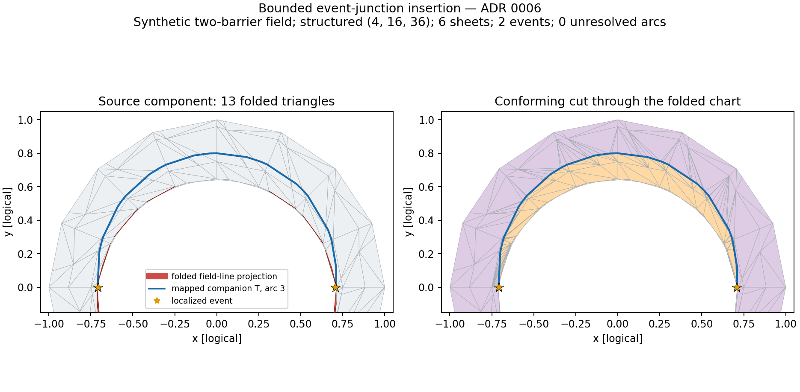

# Milestone 10.2 contact localization and event-junction cuts

Accepted ADR 0006 keeps the six-sheet and no-dangling-cut criteria unchanged.
The bounded cutter now passes both, including all six backgrounds from the ADR.
The experimental broad chart-cavity retriangulation module was removed.

## Reproduction

```bash
source .venv/bin/activate
python examples/investigate_event_junctions.py --output /tmp/event-junctions
python examples/investigate_event_junctions.py --w7x --output /tmp/w7x-events
python examples/validate_cut_equilibria.py --localize-events --output /tmp/events-matrix.json
make check
```

The investigation driver saves JSON evidence, a pickle-free cut snapshot, and
synthetic diagnostic PNG. `--resolution NR NTHETA NZETA` reproduces individual ADR
grids. Reports record source hashes. Concurrent diagnostic timings are not
clean test-budget benchmarks.

## Acceptance evidence

| Criterion | Named test and independent constraint |
| --- | --- |
| Bracketed contact becomes an explicit event | `test_localized_contacts_preserve_the_two_equal_height_maxima`: independent scalar equations pin event angles, heights, and negative curvatures. |
| Regular arcs cut without binary decomposition | `test_contact_arcs_share_physical_events_and_have_one_sided_actions` and `test_regular_arcs_cut_into_six_wells_without_dangling_event_ends`: two lower marginal barriers inside `[a,d]` give six limiting wells, with independently integrated parent/child actions and six incident sheets per event. |
| W7-X four-contact reference cuts arcs and retains events | `test_w7x_reference_four_contacts_cut_regular_arcs_with_explicit_events`: four occurrences pair into two physical events; regular arcs cut, failed arcs retain their ports, and incidence/actions survive serialization. |
| No dangling interior cut | The synthetic and W7-X cut tests require every non-degree-two cut vertex to carry `EDGE` or explicit event-endpoint provenance. |

Additional production-path safeguards:

- `test_sampled_equal_height_contact_keeps_an_explicit_event` covers an exactly
  sampled contact and an open-source terminal contact without periodic wrapping.
- `test_scan_alias_brackets_dissolve_without_inventing_physical_events` uses an
  analytic field whose ordinary crossings cannot move or acquire a barrier at the
  bounce height. Finer scans remove four false count brackets; independent
  quadrature confirms the actions. Unclassified below-b folds remain explicit.
- `test_regular_arc_certification_survives_a_source_contact_stop` verifies that
  independently certifiable arcs survive, without exceeding the source budget.
- `test_uncut_incident_arc_preserves_distinct_event_limits` catches conflicting
  limits at a shared vertex in a partial arrangement: both port values remain
  intact and the vertex is explicitly unknown, never overwritten.
- The existing DMerc budget-invariance test passes unchanged. Its source sample
  order can differ from actual boundary-chain order; the guard now recognizes
  physical `EDGE` endpoints while preserving the companion-cut degree check.

## Synthetic resolution evidence

The field and six independently identifiable well intervals are given in ADR 0006.
The bounce field is `3.001685664207343`. The baseline incoming mesh has 571 points,
904 triangles, two maximum curves with 71 and 69 vertices, and 13 folded chart
triangles. No incoming component is merged or omitted.

| Structured grid | Sheets | Physical events | Unresolved arcs | Largest inserted face corridor |
| --- | ---: | ---: | ---: | ---: |
| 4,16,36 | 6 | 2 | 0 | 13 |
| 4,16,48 | 6 | 2 | 0 | 25 |
| 4,24,36 | 6 | 2 | 0 | 16 |
| 4,24,54 | 6 | 2 | 0 | 16 |
| 6,24,54 | 6 | 2 | 0 | 2 |
| 4,16,45 | 6 | 2 | 0 | 25 |

All corridors are below the 64-face bound. All twelve ports have valid sheet
incidence; no triangle spans the parent/child jump. Maximum port action error is
below `9e-15`; all cut serialization round trips agree. Scalar flux change from
insertion is below `3.5e-5` relative. This is topology stability evidence, not a
convergence rate or a bound on weighted volume, triangle quality, or reachability.



The figure shows the component carrying arc 3: input chart folds are red, the
mapped companion is blue, and events are stars. The right panel colors the cut
sheets. All four arcs cut in the full arrangement. Details are in
`milestone10.2-event-junctions.json` and `milestone10.2-resolution-sweep.json`.

The additional `map_transitions_budget_sweep` run reuses original-vertex traces
at budgets 8, 10, 16, and full (`milestone10.2-event-budget-sweep.json`). Budgets
8/10 leave all four arcs sampling-insufficient; budget 16 certifies two arcs but
their geometry cannot yet be cut (a sub-resolution reversal and a nonseparating
side). These runs keep all four arcs unresolved and three uncut geometric
components, not a three-well physical result. Full mapping cuts all four arcs
and gives six sheets. Both source `total_u_length` values are identical across
budgets. This sensitivity is reported, not tuned away; sampling certification
alone does not override the independent geometric cut guards.

## W7-X and unresolved measure

The W7-X reference uses `boozmn_W7-X_without_coil_ripple_beta0p05_d23p4_tm_reference.nc`,
`b=2.7781394`, structured `(6,24,12)`, and marching tetrahedra. Four source brackets
pair into events at `s=0.1184098663731` and `s=0.318907160215` on lifted field lines.
Final parameter brackets are narrower than `1e-5`.

Five arcs result: arcs 1 and 3 cut; arcs 0 and 4 retain unresolved coarse `EDGE`
strips, and arc 2 retains an unresolved nonseparating companion. There are two
geometric sheets, not a claim of resolved physical topology. At two shared event
vertices, the uncut incident arc leaves incompatible child limits: four endpoint
samples therefore refer to explicitly unknown mesh action. Their distinct finite
limits remain on the ports. Other port actions agree with the mesh to about `9e-15`.

Diagnostics skip surface-wide action tracing and use production side probes for
assignment. Unknown-action triangles remain present. `unresolved_action_flux`
accounts for their complete dimensionless `|ds wedge d alpha|` measure; it is
**not** a K-weighted volume or a Theta bound. Event connectivity and uncut-arc
uncertainty remain separate. Milestone 10.3 owns coordinated refinement; later
reachability/quadrature must carry every unknown contribution.

## Mutations and gates

Two process-local mutations were observed red and removed on process exit; no
production files were mutated during matrix runs:

1. Replace the independently integrated event parent action with child 1 alone.
   `test_contact_arcs_share_physical_events_and_have_one_sided_actions` fails with
   an omitted contribution of about `2.44979498` in length units.
2. Restore the old vertex-path fallback instead of adjacent-face insertion.
   `test_regular_arcs_cut_into_six_wells_without_dangling_event_ends` fails at
   **5 != 6**. The accidental branch is not relabeled as a physical event.

`make check` passes all **174 tests** (159.69 s pytest; 162.27 s command
wall time), including the unchanged 21 mesh-cut tests. The new W7-X test is `slow`;
the same event physics retains fast production synthetic tests and both mutations
above. No test was weakened, skipped, xfailed, or deleted. `make test` passes
173 fast tests in 68.17 s pytest / 68.57 s command wall time; its slowest test is
19.93 s. The full gate's largest durations are W7-X fixture setup 83.91 s,
the existing bounce-point plot 20.20 s, W7-X cutting/persistence 17.35 s,
the existing J-refinement check 15.00 s, and the new six-sheet test 10.65 s.
After the matrix completed, standalone `make test-full` passes all 174 tests in
144.32 s pytest / **144.59 s command wall time**. Its largest durations are W7-X
fixture setup 79.17 s, the existing bounce-point plot 17.55 s, W7-X cutting and
persistence 16.21 s, and the new six-sheet test 10.23 s. Setup and call durations
are listed separately as pytest reports them; the W7-X test including setup is
about 95 s. Both global tier budgets are met without changing numerical inputs.
The publication/CI gate is still pending; the milestone row stays unchecked.

The completed 100-case matrix and diagnosed backend/extractor differences are in
`milestone10.2-real-equilibria.md` and its JSON companion. It reproduces 164 source
curves, retains 951 unresolved arcs without exceptions, and makes no real-matrix
convergence claim. All cases affected by the endpoint fixes were rerun on the
final core. GitHub publication and its Tests gate remain pending.
