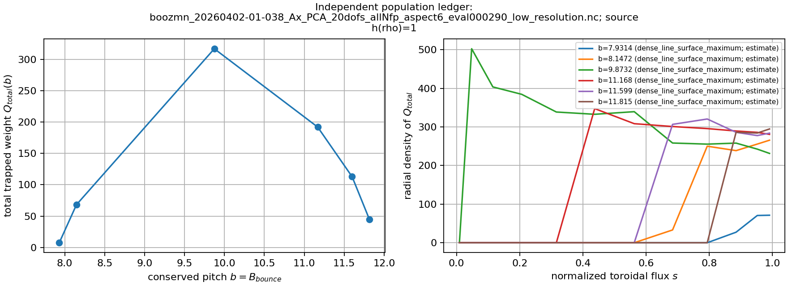
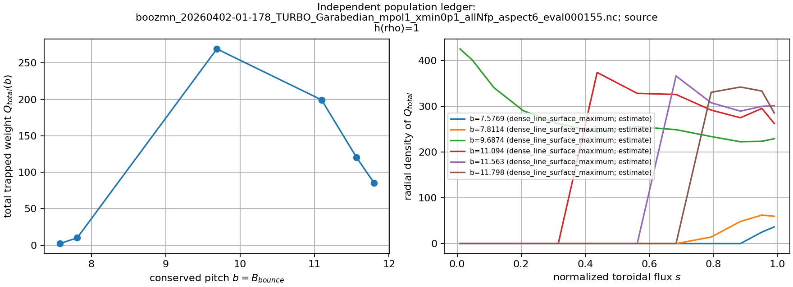
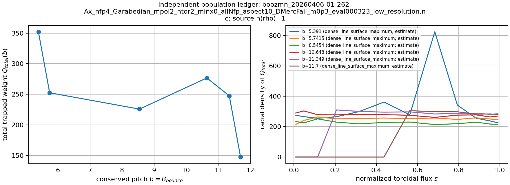
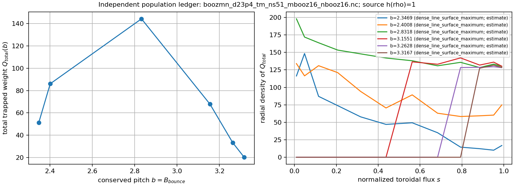
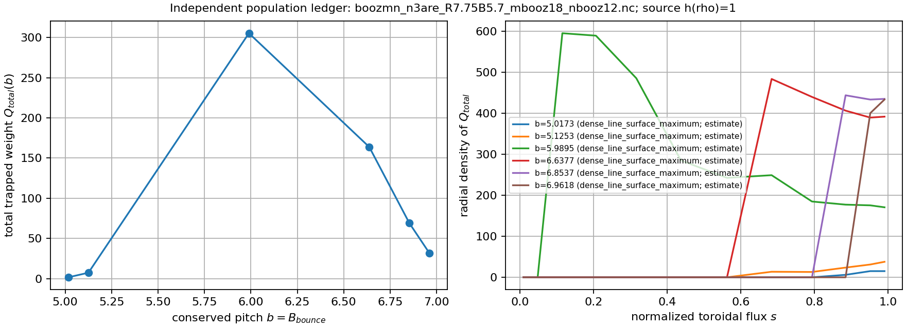

# R0 independent population-ledger evidence

This is a ledger-only run on the five reference equilibria and six required
radially global pitch levels. It does **not** classify accessibility and every
number below remains a quadrature **estimate**, not a field-level enclosure.

Source: `h(rho)=1 (UniformSourceProfile)`. Revision: `bb2a39f94662e4f58f6c017ea8748a1c66f5297f`.
Total wall time: 7.112 s on macOS-14.7.6-arm64-arm-64bit
with one worker, new field objects, and an uncontrolled warm OS file cache.

## Assumptions and uncontrolled scope

- dense-line surface-maximum equality is assumed, not certified on rational plateaus
- surface maxima at population nodes are sampled-grid estimates, not upper bounds
- coarse-fine differences are convergence diagnostics, not error enclosures
- field interpolation, extrema, population and denominator quadrature errors are uncontrolled

The pitch support uses the locally optimized global extrema estimates. The
population-node surface maxima are sampled on each listed angular grid. Neither
optimization nor coarse/fine agreement is promoted into a rigorous bound.

## Whole-band estimates

| field | B min | B max | trapped fraction (fine) | |fine-coarse| | wall s |
| --- | ---: | ---: | ---: | ---: | ---: |
| boozmn_20260402-01-038_Ax_PCA_20dofs_allNfp_aspect6_eval000290_low_resolution.nc | 7.7156843 | 12.03069 | 0.38462758 | 3.351e-04 | 1.622 |
| boozmn_20260402-01-178_TURBO_Garabedian_mpol1_xmin0p1_allNfp_aspect6_eval000155.nc | 7.342417 | 12.032438 | 0.36669897 | 2.350e-05 | 1.422 |
| boozmn_20260406-01-262-Ax_nfp4_Garabedian_mpol2_ntor2_minx0_allNfp_aspect10_DMercFail_m0p3_eval000323_low_resolution.nc | 5.0404659 | 12.050344 | 0.62959086 | 4.782e-06 | 1.477 |
| boozmn_d23p4_tm_ns51_mbooz16_nbooz16.nc | 2.293059 | 3.3705889 | 0.39615999 | 5.804e-05 | 1.387 |
| boozmn_n3are_R7.75B5.7_mbooz18_nbooz12.nc | 4.9092607 | 7.0698003 | 0.27817912 | 6.299e-05 | 1.145 |

The nonsingular whole-band primitive changes by at most 3.351e-04 between these grids. Individual fixed-b
tensor estimates change by as much as 46.8%: their integrable B=b singularity is not
resolved by this fixed-node diagnostic. Those slice numbers are not bounds
and later bounded slice quadrature must not treat their grid difference as one.

## Slice estimates

| field | lambda_n | b | Q total (fine) | |fine-coarse| |
| --- | ---: | ---: | ---: | ---: |
| boozmn_20260402-01-038_Ax_PCA_20dofs_allNfp_aspect6_eval000290_low_resolution.nc | 0.05 | 7.9314346 | 7.6367183 | 1.487e+00 |
| boozmn_20260402-01-038_Ax_PCA_20dofs_allNfp_aspect6_eval000290_low_resolution.nc | 0.1 | 8.1471849 | 68.294595 | 8.930e+00 |
| boozmn_20260402-01-038_Ax_PCA_20dofs_allNfp_aspect6_eval000290_low_resolution.nc | 0.5 | 9.8731872 | 316.6629 | 2.729e+01 |
| boozmn_20260402-01-038_Ax_PCA_20dofs_allNfp_aspect6_eval000290_low_resolution.nc | 0.8 | 11.167689 | 191.94211 | 4.595e+01 |
| boozmn_20260402-01-038_Ax_PCA_20dofs_allNfp_aspect6_eval000290_low_resolution.nc | 0.9 | 11.59919 | 112.78262 | 3.526e+01 |
| boozmn_20260402-01-038_Ax_PCA_20dofs_allNfp_aspect6_eval000290_low_resolution.nc | 0.95 | 11.81494 | 45.039996 | 1.808e+01 |
| boozmn_20260402-01-178_TURBO_Garabedian_mpol1_xmin0p1_allNfp_aspect6_eval000155.nc | 0.05 | 7.576918 | 2.2047526 | 7.416e-02 |
| boozmn_20260402-01-178_TURBO_Garabedian_mpol1_xmin0p1_allNfp_aspect6_eval000155.nc | 0.1 | 7.8114191 | 10.070403 | 6.568e-01 |
| boozmn_20260402-01-178_TURBO_Garabedian_mpol1_xmin0p1_allNfp_aspect6_eval000155.nc | 0.5 | 9.6874276 | 269.13578 | 2.659e-02 |
| boozmn_20260402-01-178_TURBO_Garabedian_mpol1_xmin0p1_allNfp_aspect6_eval000155.nc | 0.8 | 11.094434 | 199.26247 | 7.218e+01 |
| boozmn_20260402-01-178_TURBO_Garabedian_mpol1_xmin0p1_allNfp_aspect6_eval000155.nc | 0.9 | 11.563436 | 120.40247 | 4.044e+01 |
| boozmn_20260402-01-178_TURBO_Garabedian_mpol1_xmin0p1_allNfp_aspect6_eval000155.nc | 0.95 | 11.797937 | 85.574034 | 8.036e+00 |
| boozmn_20260406-01-262-Ax_nfp4_Garabedian_mpol2_ntor2_minx0_allNfp_aspect10_DMercFail_m0p3_eval000323_low_resolution.nc | 0.05 | 5.3909598 | 352.11035 | 3.186e+01 |
| boozmn_20260406-01-262-Ax_nfp4_Garabedian_mpol2_ntor2_minx0_allNfp_aspect10_DMercFail_m0p3_eval000323_low_resolution.nc | 0.1 | 5.7414537 | 252.44513 | 2.876e+00 |
| boozmn_20260406-01-262-Ax_nfp4_Garabedian_mpol2_ntor2_minx0_allNfp_aspect10_DMercFail_m0p3_eval000323_low_resolution.nc | 0.5 | 8.5454047 | 225.79191 | 1.052e+01 |
| boozmn_20260406-01-262-Ax_nfp4_Garabedian_mpol2_ntor2_minx0_allNfp_aspect10_DMercFail_m0p3_eval000323_low_resolution.nc | 0.8 | 10.648368 | 276.68095 | 7.323e+00 |
| boozmn_20260406-01-262-Ax_nfp4_Garabedian_mpol2_ntor2_minx0_allNfp_aspect10_DMercFail_m0p3_eval000323_low_resolution.nc | 0.9 | 11.349356 | 247.42742 | 3.352e+01 |
| boozmn_20260406-01-262-Ax_nfp4_Garabedian_mpol2_ntor2_minx0_allNfp_aspect10_DMercFail_m0p3_eval000323_low_resolution.nc | 0.95 | 11.69985 | 147.4375 | 3.346e+00 |
| boozmn_d23p4_tm_ns51_mbooz16_nbooz16.nc | 0.05 | 2.3469355 | 51.389461 | 2.843e-01 |
| boozmn_d23p4_tm_ns51_mbooz16_nbooz16.nc | 0.1 | 2.400812 | 86.090077 | 8.916e+00 |
| boozmn_d23p4_tm_ns51_mbooz16_nbooz16.nc | 0.5 | 2.831824 | 144.24591 | 3.688e+00 |
| boozmn_d23p4_tm_ns51_mbooz16_nbooz16.nc | 0.8 | 3.1550829 | 67.879003 | 4.132e+00 |
| boozmn_d23p4_tm_ns51_mbooz16_nbooz16.nc | 0.9 | 3.2628359 | 33.283595 | 1.359e+00 |
| boozmn_d23p4_tm_ns51_mbooz16_nbooz16.nc | 0.95 | 3.3167124 | 20.266124 | 9.492e+00 |
| boozmn_n3are_R7.75B5.7_mbooz18_nbooz12.nc | 0.05 | 5.0172877 | 1.6429317 | 3.911e-01 |
| boozmn_n3are_R7.75B5.7_mbooz18_nbooz12.nc | 0.1 | 5.1253147 | 7.3527895 | 6.267e-01 |
| boozmn_n3are_R7.75B5.7_mbooz18_nbooz12.nc | 0.5 | 5.9895305 | 305.27761 | 5.613e+00 |
| boozmn_n3are_R7.75B5.7_mbooz18_nbooz12.nc | 0.8 | 6.6376924 | 163.71428 | 5.108e+01 |
| boozmn_n3are_R7.75B5.7_mbooz18_nbooz12.nc | 0.9 | 6.8537463 | 68.951682 | 2.983e+01 |
| boozmn_n3are_R7.75B5.7_mbooz18_nbooz12.nc | 0.95 | 6.9617733 | 31.625761 | 2.658e+00 |

## Diagnostics

