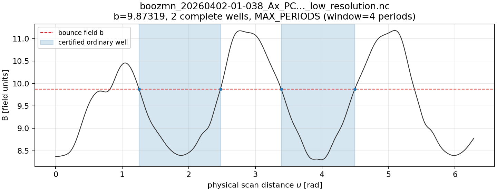
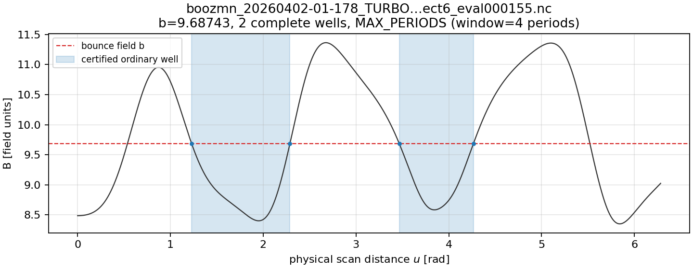
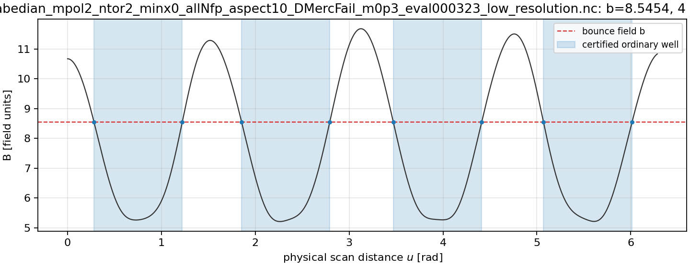
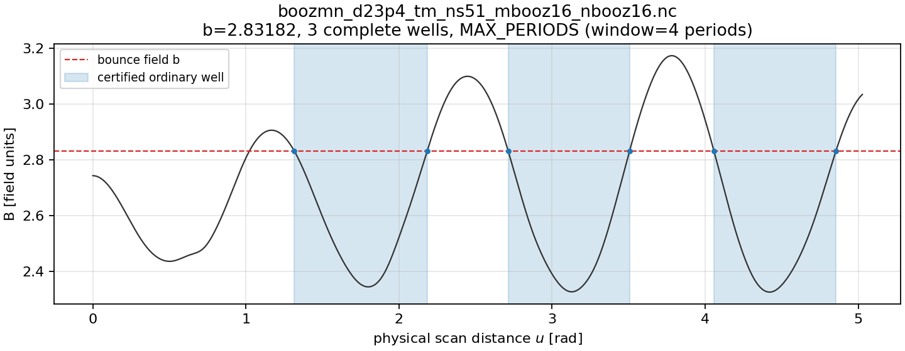
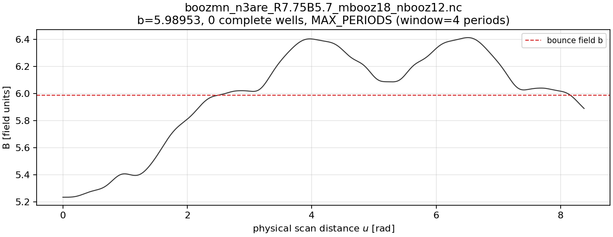

# R1 shared forward-scan evidence

This is a one-line-per-field R1 probe of all 30 physical file/pitch cases,
at two scan resolutions. It does not establish global atlas coverage,
population bounds, accessibility or final f acceptance.

Baseline: `92b057746b94c7bb835ecfb83637cddabb37d581`. Code SHA256: `d4c9dd499a066b051a64de1bc4d5860cd169a270c681d9224d52b50d87cfdec8`.
Hardware: `macOS-14.7.6-arm64-arm-64bit`; one worker; new field objects, warm OS cache uncontrolled.
Source declaration: `h(rho)=1 (UniformSourceProfile); scans and A/K are source independent`.
Pitch source: R0 sampled radially global extrema estimates; not field bounds.
Numerical scope: Fourier-model root envelope; A/K n-versus-2n estimates; no field enclosure.
The scan uses s=0.5, theta0=zeta0=0 and four field periods; a window
boundary stays censored. Each catalogue is shared over all six pitches.
The table reports complete wells only; incomplete roots are not assigned
zero action or classified passing.
Per resolution: 12 complete-window probes, 16 censored-window probes, 2 analytic passing-line proofs. No B=b root cell remained unresolved in these sampled lines; up to 10 cells per line still lack an extrema-completeness proof.
Measured shared scan+query: 1.311 s across both grids and all pitches; fresh catalogue scan+query per pitch: 6.718 s (5.12x cost ratio).
This comparison uses the same field objects and one line per field;
it excludes quadrature from both sides and is not a whole-equilibrium speed claim.
Maximum matched coarse/fine relative A or K difference: 1.542e-09 (resolution diagnostic only).
All 64 complete-well integrals across the two grids returned finite A/K. Maximum first-well relative difference from independent adaptive quadrature: 6.772e-10.

| field | λn | level | complete wells | status | unknown cells | scan s | query+batch s |
| --- | ---: | --- | ---: | --- | ---: | ---: | ---: |
| 0 | 0.05 | coarse | 0 | REGULAR | 0 | 0.073 | 0.003 |
| 0 | 0.1 | coarse | 0 | REGULAR | 0 | 0.073 | 0.003 |
| 0 | 0.5 | coarse | 2 | MAX_PERIODS | 0 | 0.073 | 0.017 |
| 0 | 0.8 | coarse | 1 | MAX_PERIODS | 0 | 0.073 | 0.016 |
| 0 | 0.9 | coarse | 0 | MAX_PERIODS | 0 | 0.073 | 0.003 |
| 0 | 0.95 | coarse | 0 | MAX_PERIODS | 0 | 0.073 | 0.003 |
| 0 | 0.05 | fine | 0 | REGULAR | 0 | 0.126 | 0.006 |
| 0 | 0.1 | fine | 0 | REGULAR | 0 | 0.126 | 0.005 |
| 0 | 0.5 | fine | 2 | MAX_PERIODS | 0 | 0.126 | 0.021 |
| 0 | 0.8 | fine | 1 | MAX_PERIODS | 0 | 0.126 | 0.019 |
| 0 | 0.9 | fine | 0 | MAX_PERIODS | 0 | 0.126 | 0.009 |
| 0 | 0.95 | fine | 0 | MAX_PERIODS | 0 | 0.126 | 0.006 |
| 1 | 0.05 | coarse | 0 | REGULAR | 0 | 0.102 | 0.007 |
| 1 | 0.1 | coarse | 0 | REGULAR | 0 | 0.102 | 0.003 |
| 1 | 0.5 | coarse | 2 | MAX_PERIODS | 0 | 0.102 | 0.018 |
| 1 | 0.8 | coarse | 1 | MAX_PERIODS | 0 | 0.102 | 0.009 |
| 1 | 0.9 | coarse | 0 | MAX_PERIODS | 0 | 0.102 | 0.004 |
| 1 | 0.95 | coarse | 0 | MAX_PERIODS | 0 | 0.102 | 0.003 |
| 1 | 0.05 | fine | 0 | REGULAR | 0 | 0.163 | 0.006 |
| 1 | 0.1 | fine | 0 | REGULAR | 0 | 0.163 | 0.007 |
| 1 | 0.5 | fine | 2 | MAX_PERIODS | 0 | 0.163 | 0.029 |
| 1 | 0.8 | fine | 1 | MAX_PERIODS | 0 | 0.163 | 0.017 |
| 1 | 0.9 | fine | 0 | MAX_PERIODS | 0 | 0.163 | 0.006 |
| 1 | 0.95 | fine | 0 | MAX_PERIODS | 0 | 0.163 | 0.005 |
| 2 | 0.05 | coarse | 4 | REGULAR | 0 | 0.083 | 0.019 |
| 2 | 0.1 | coarse | 4 | REGULAR | 0 | 0.083 | 0.011 |
| 2 | 0.5 | coarse | 4 | REGULAR | 0 | 0.083 | 0.011 |
| 2 | 0.8 | coarse | 4 | REGULAR | 0 | 0.083 | 0.026 |
| 2 | 0.9 | coarse | 1 | MAX_PERIODS | 0 | 0.083 | 0.012 |
| 2 | 0.95 | coarse | 0 | MAX_PERIODS | 0 | 0.083 | 0.003 |
| 2 | 0.05 | fine | 4 | REGULAR | 0 | 0.145 | 0.020 |
| 2 | 0.1 | fine | 4 | REGULAR | 0 | 0.145 | 0.016 |
| 2 | 0.5 | fine | 4 | REGULAR | 0 | 0.145 | 0.015 |
| 2 | 0.8 | fine | 4 | REGULAR | 0 | 0.145 | 0.029 |
| 2 | 0.9 | fine | 1 | MAX_PERIODS | 0 | 0.145 | 0.014 |
| 2 | 0.95 | fine | 0 | MAX_PERIODS | 0 | 0.145 | 0.005 |
| 3 | 0.05 | coarse | 3 | REGULAR | 0 | 0.074 | 0.013 |
| 3 | 0.1 | coarse | 3 | REGULAR | 0 | 0.074 | 0.019 |
| 3 | 0.5 | coarse | 3 | MAX_PERIODS | 0 | 0.074 | 0.020 |
| 3 | 0.8 | coarse | 0 | MAX_PERIODS | 0 | 0.074 | 0.004 |
| 3 | 0.9 | coarse | 0 | MAX_PERIODS | 0 | 0.074 | 0.002 |
| 3 | 0.95 | coarse | 0 | NO_WELL | 0 | 0.074 | 0.000 |
| 3 | 0.05 | fine | 3 | REGULAR | 0 | 0.111 | 0.017 |
| 3 | 0.1 | fine | 3 | REGULAR | 0 | 0.111 | 0.016 |
| 3 | 0.5 | fine | 3 | MAX_PERIODS | 0 | 0.111 | 0.014 |
| 3 | 0.8 | fine | 0 | MAX_PERIODS | 0 | 0.111 | 0.005 |
| 3 | 0.9 | fine | 0 | MAX_PERIODS | 0 | 0.111 | 0.005 |
| 3 | 0.95 | fine | 0 | NO_WELL | 0 | 0.111 | 0.000 |
| 4 | 0.05 | coarse | 0 | REGULAR | 0 | 0.043 | 0.002 |
| 4 | 0.1 | coarse | 0 | REGULAR | 0 | 0.043 | 0.002 |
| 4 | 0.5 | coarse | 0 | MAX_PERIODS | 0 | 0.043 | 0.004 |
| 4 | 0.8 | coarse | 0 | MAX_PERIODS | 0 | 0.043 | 0.002 |
| 4 | 0.9 | coarse | 0 | MAX_PERIODS | 0 | 0.043 | 0.002 |
| 4 | 0.95 | coarse | 0 | NO_WELL | 0 | 0.043 | 0.000 |
| 4 | 0.05 | fine | 0 | REGULAR | 0 | 0.088 | 0.005 |
| 4 | 0.1 | fine | 0 | REGULAR | 0 | 0.088 | 0.005 |
| 4 | 0.5 | fine | 0 | MAX_PERIODS | 0 | 0.088 | 0.005 |
| 4 | 0.8 | fine | 0 | MAX_PERIODS | 0 | 0.088 | 0.004 |
| 4 | 0.9 | fine | 0 | MAX_PERIODS | 0 | 0.088 | 0.004 |
| 4 | 0.95 | fine | 0 | NO_WELL | 0 | 0.088 | 0.000 |

## Files and diagnostic plots

- 0: `boozmn_20260402-01-038_Ax_PCA_20dofs_allNfp_aspect6_eval000290_low_resolution.nc` SHA256 `49eec0d9ff88fb52cc377be7d190da35b6815210baa36c5daee2bea7f6ab3fbd`; load 0.007 s
  
- 1: `boozmn_20260402-01-178_TURBO_Garabedian_mpol1_xmin0p1_allNfp_aspect6_eval000155.nc` SHA256 `ec583795826f7b9cb213d0c63977ecc03b1e72e98bcc53de9a0621f17934202e`; load 0.006 s
  
- 2: `boozmn_20260406-01-262-Ax_nfp4_Garabedian_mpol2_ntor2_minx0_allNfp_aspect10_DMercFail_m0p3_eval000323_low_resolution.nc` SHA256 `43346b456ee4b2654b2d6d13e9d85837ab7051de1b015b5a763c55f8007bbda7`; load 0.008 s
  
- 3: `boozmn_d23p4_tm_ns51_mbooz16_nbooz16.nc` SHA256 `c99156e12f828b58798b959d7768307aeb5415900f0860b4e3825156bfc4f36c`; load 0.008 s
  
- 4: `boozmn_n3are_R7.75B5.7_mbooz18_nbooz12.nc` SHA256 `1b2f8b945f3bee66c473b1c0335fd072e30e183303ebafc2d3776f1d1c29e660`; load 0.006 s
  

The JSON companion retains all controls, root/window flags, unverified
extrema cells, each completed well and its A/K estimate, adaptive reference
and legacy first-well timing. The adaptive and GL error fields are numerical
estimates, not rigorous quadrature or field enclosures.
